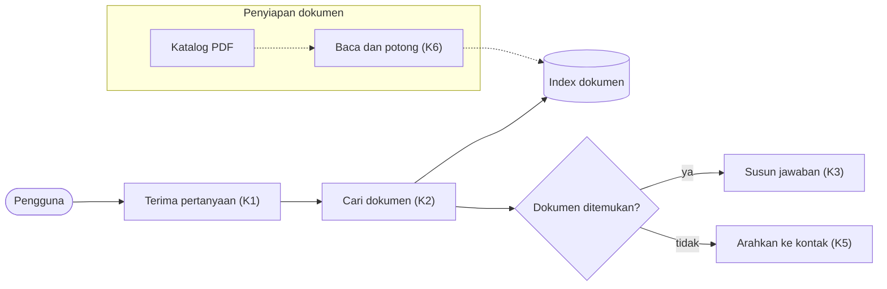

# Arsip Rancangan

Dibaca red-chan saat membuat atau menyetujui rancangan, dan pink-chan saat menyusun rencana pembangunan atau memperbarui status.

Setiap rancangan disimpan sebagai pasangan file plan dengan satu nomor: **`a`** desain sistem dari red-chan, **`b`** rencana pembangunan dari pink-chan. Statusnya dicatat di satu tempat, `docs/daftar-rancangan.md`. `docs/keputusan-produk.md` tetap menyimpan kondisi terkini sistem; arsip menyimpan riwayatnya.

```
docs/
├── keputusan-produk.md                         kondisi terkini sistem
├── rencana-evaluasi.md                         kondisi terkini evaluasi
├── daftar-rancangan.md                         pencatatan status semua plan
└── rancangan/                                  HANYA file plan
    ├── 001a_2026-09-20_mvp-chatbot-katalog.md       red-chan  · desain sistem
    ├── 001b_2026-09-21_mvp-chatbot-katalog.md       pink-chan · rencana pembangunan
    ├── 002a_2026-10-03_dev-harga-dan-singkatan.md
    └── 002b_2026-10-04_dev-harga-dan-singkatan.md
```

## Aturan penamaan dan penyimpanan

- Nama file: `<nomor 3 digit><huruf>_<tanggal>_<fase>-<judul-singkat>.md`. Huruf `a` = red-chan, `b` = pink-chan. Judul `a` dan `b` sama.
- **Nomor baru** dibuat red-chan setiap memulai rancangan baru: nomor terbesar di `docs/daftar-rancangan.md` + 1. Pink-chan tidak membuat nomor; `b` selalu memakai nomor `a`-nya.
- Rancangan evaluasi mendapat nomor sendiri, dengan judul diawali `rancang-evaluasi`; `b`-nya rencana membangun alat evaluasi.
- Folder `docs/rancangan/` hanya berisi file plan — tidak ada file lain.
- Mode data rahasia: plan tidak memuat isi data asli.

## Kapan file ditulis

| Plan | Ditulis | Selama `usulan` | Setelah disetujui |
|---|---|---|---|
| `a` · red-chan | Saat Arya menyetujui desain | — (usulan hanya ada di laporan dan `keputusan-produk.md`) | Tidak pernah diubah |
| `b` · pink-chan | Saat pink-chan mengusulkan rencana pembangunan | Boleh direvisi mengikuti koreksi Arya | Tidak pernah diubah |

Kalau pembangunan perlu berubah setelah `b` disetujui: perubahan kecil (misalnya satu langkah dipecah dua) dicatat di laporan pink-chan dan kolom Pembangunan; perubahan besar dibawa ke red-chan sebagai nomor baru.

---

## `docs/daftar-rancangan.md` — pencatatan status

```markdown
# Daftar Rancangan — <nama produk>

| No | Judul | Fase | a · Desain sistem | b · Rencana pembangunan | Pembangunan | Status |
|---|---|---|---|---|---|---|
| 001 | Chatbot katalog | MVP | [disetujui 2026-09-20](rancangan/001a_2026-09-20_mvp-chatbot-katalog.md) | [disetujui 2026-09-21](rancangan/001b_2026-09-21_mvp-chatbot-katalog.md) | 5 dari 5 | selesai |
| 002 | Harga dan singkatan | Dev | [disetujui 2026-10-03](rancangan/002a_...) | [disetujui 2026-10-04](rancangan/002b_...) | 2 dari 4 | sedang dibangun |
| 003 | Cek stok | Dev | usulan | — | — | menunggu Arya |
```

| Kolom | Nilai | Diperbarui oleh |
|---|---|---|
| a · Desain sistem | `usulan` → `disetujui <tanggal>` (tautan ke file `a`) | red-chan |
| b · Rencana pembangunan | `—` → `usulan` (tautan ke file `b`) → `disetujui <tanggal>` | pink-chan |
| Pembangunan | `—` → `<n> dari <total>` | pink-chan, setiap selesai satu langkah |
| Status | lihat tabel berikut | yang terakhir mengubah baris |

| Status | Artinya |
|---|---|
| `menunggu Arya` | Ada `a` atau `b` berstatus usulan yang perlu disetujui |
| `siap disusun` | `a` disetujui; pink-chan belum menyusun `b` |
| `sedang dibangun` | `b` disetujui; pembangunan berjalan |
| `selesai` | Semua langkah di `b` selesai |
| `dibatalkan` | Arya membatalkan; baris tetap ada, alasan ditulis setelah status |

**Kapan baris diubah:**

| Kejadian | Oleh | Perubahan |
|---|---|---|
| Red-chan mengirim usulan desain baru | red-chan | Baris baru: a `usulan`, Status `menunggu Arya` |
| Arya menyetujui desain | red-chan | Tulis file `a`; a `disetujui <tanggal>`; Status `siap disusun` |
| Pink-chan mengusulkan rencana pembangunan | pink-chan | Tulis file `b`; b `usulan`; Status `menunggu Arya` |
| Arya menyetujui rencana | pink-chan | b `disetujui <tanggal>`; Pembangunan `0 dari <total>`; Status `sedang dibangun` |
| Satu langkah selesai | pink-chan | Pembangunan `<n> dari <total>`; langkah terakhir → Status `selesai` |
| Arya membatalkan | yang sedang bekerja | Status `dibatalkan — <alasan>` |

Hanya kolom yang disebut di atas yang diubah; baris lain tidak disentuh.

**Mode plan Claude Code:** selama plan belum disetujui tidak ada yang ditulis, jadi tahap `usulan` di daftar dilewati. Setelah plan disetujui, red-chan langsung menulis baris dengan a `disetujui <tanggal>` dan Status `siap disusun`; pink-chan langsung menulis file `b` berstatus `disetujui` dan baris b `disetujui`, Status `sedang dibangun`.

---

## Isi file `a` — desain sistem (red-chan)

File `a` adalah **rujukan pink-chan**. Bagian "Yang dirancang atau diubah" dan "Rincian engineering" wajib lengkap: pink-chan membangun hanya yang tercantum di sana.

```markdown
# <nomor>a · <Fase> · <Judul>

Disetujui: YYYY-MM-DD
Produk: <nama> · Jenis: <jenis> · Data: <tingkat, mode>
Dasar: <nomor rancangan sebelumnya, kalau ada>
Dokumen terkait: docs/keputusan-produk.md | docs/rencana-evaluasi.md

## Diagram alur
<diagram Mermaid — aturan di bawah>

## Yang dirancang atau diubah
<MVP / rancangan pertama: "Rancangan pertama" + daftar bagian sistem yang dibangun.
 Dev / Production: dibanding <nomor>a sebelumnya:>
| Jenis | Bagian / keputusan | Sebelumnya | Sekarang |
|---|---|---|---|
| Baru | K9 Price lookup | — | Tabel harga code → price |
| Diubah | K2 Retrieval | Dense saja | Hybrid BM25 + dense, RRF |
| Dihapus | ... | ... | — |
Tidak berubah: <daftar nomor keputusan>

## Rincian engineering
<kartu engineering lengkap untuk setiap keputusan baru atau diubah:
 pendekatan, rumus, parameter, alternatif ditolak, metrik>

## Laporan rancangan
<salinan laporan terminal yang disetujui, apa adanya, termasuk diagram teks,
 bentrokan, asumsi, riset>

## Titik periksa dan pilihan Arya
<setiap titik periksa, pilihan yang diambil ditandai ✓>

## Koreksi selama putaran
<koreksi Arya sebelum disetujui, satu baris per koreksi; "tidak ada" kalau langsung disetujui>

## Perintah untuk pink-chan
pink-chan, susun rencana pembangunan dari docs/rancangan/<file a>
```

## Isi file `b` — rencana pembangunan (pink-chan)

Tanpa diagram.

```markdown
# <nomor>b · <Fase> · <Judul>

Status: usulan | disetujui YYYY-MM-DD
Dari: docs/rancangan/<file a>
Kondisi kode: <project baru | ringkasan bagian yang sudah ada dan akan disentuh>

## Peta keputusan → kode
| Keputusan | Folder / file | Class / fungsi utama | Peran (writer-code) |
|---|---|---|---|

## Langkah
| # | Yang dibangun | File disentuh | Test | Gate (dari rencana-evaluasi) | Bergantung pada |
|---|---|---|---|---|---|

## Tidak dibangun di rencana ini

## Risiko teknis

## Koreksi selama putaran
```

---

## Diagram Mermaid di file `a`

Mermaid tampil sebagai gambar saat file dibuka di VS Code (extension Markdown Preview Mermaid Support), GitHub, atau Obsidian. Diagram teks tetap disimpan di bagian Laporan rancangan untuk dibaca di terminal.

Isi diagramnya sama dengan diagram teks di laporan: alur data, ditambah tempat berjalan di fase Production.

| Unsur | Tulisan Mermaid | Artinya |
|---|---|---|
| Arah | `flowchart LR` atau `flowchart TD` | Kiri ke kanan / atas ke bawah |
| Bagian sistem | `id["Label"]` | Kotak |
| Pengguna | `id(["Label"])` | Kotak bulat |
| Tempat data | `id[("Label")]` | Silinder |
| Titik keputusan | `id{"Label?"}` | Belah ketupat |
| Alur saat pengguna meminta | `-->` | Panah tegas |
| Alur terjadwal / di belakang layar | `-.->` | Panah putus-putus |
| Simpangan | `-- ya -->` | Panah berlabel |
| Satu jenis produk / satu server | `subgraph id["Label"] ... end` | Kelompok |

**Supaya tidak rusak** (red-chan tidak bisa menguji tampilannya):
- ID pendek tanpa spasi (`retriever`); teks di label bertanda kutip: `retriever["Hybrid retriever (K2) ✎"]`.
- Setiap label memakai tanda kutip dan menyebut nomor keputusan. Fase Dev menambahkan `★` / `✎` di label.
- Tanpa HTML, ikon, warna, atau gaya.
- Maksimal 15 kotak per diagram; lebih dari itu, pecah menjadi dua diagram.

````markdown

````
