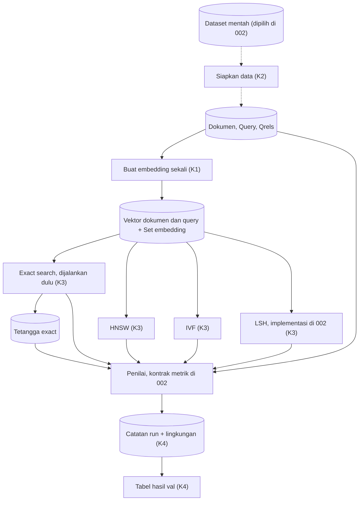

# 001a · MVP · Benchmark retrieval

Disetujui: 2026-10-02
Produk: indonesian-retrieval-benchmark · Jenis: riset ML (benchmark algoritma pencarian vektor) · Data: tingkat 0, dataset belum dipilih (dirancang di 002); mode data rahasia tidak aktif
Dasar: —
Dokumen terkait: docs/keputusan-produk.md | docs/rencana-evaluasi.md (belum ada)

## Diagram alur



## Yang dirancang atau diubah

Rancangan pertama. Bagian sistem yang disiapkan tempatnya di struktur project (tanpa kode):

| Jenis | Bagian / keputusan | Sebelumnya | Sekarang |
|---|---|---|---|
| Baru | Penyiapan data (K2) | — | Baca korpus, query, qrels; periksa kunci dan relasi; bagi query val/test 50:50 seed 42, dikunci hash |
| Baru | Pembuat embedding (K1) | — | congen-indobert-base, revision dicatat, max_seq_length 32, normalisasi L2, sekali untuk semua algoritma |
| Baru | Exact search (K3) | — | Brute-force; baseline dan sumber Tetangga exact; dijalankan sebelum ANN |
| Baru | HNSW, IVF, LSH (K3) | — | Tiga bagian setingkat, membaca vektor yang sama, hasil ke Penilai |
| Baru | Penilai | — | Tempat saja; kontrak metrik di 002 |
| Baru | Catatan run dan lingkungan, Tabel hasil (K4) | — | Catatan run hanya ditambah; lingkungan per sesi; tabel hasil dari catatan run |
| Baru | Model data | — | Sembilan entitas dengan kunci dan aturan integritas (lihat Rincian engineering) |

Tidak berubah: — (rancangan pertama)

Tidak dibangun di 001 (ditetapkan di 002): tech stack, library, dan tools; kontrak metrik evaluasi; dataset korpus dan query; implementasi LSH; parameter tiap algoritma dan nilai k; hardware dan aturan pengukuran efisiensi. Struktur tidak boleh mengandaikan format dataset, nama library, atau kolom metrik tertentu.

## Rincian engineering

Fase MVP: keputusan ditulis sederhana; tidak ada rumus karena kontrak metrik ditunda ke 002.

```
K1 · Embedding model usage — Umum [S1]
Pendekatan   LazarusNLP/congen-indobert-base (dikunci), mean pooling bawaan,
             tanpa prefix query/dokumen
Parameter    max_seq_length = 32 untuk dokumen dan query (bawaan model,
             pilihan Arya); normalisasi L2 → inner product = cosine;
             revision (commit hash) dicatat di Set embedding
Kenapa       Embedding sekali dan dipakai bersama → perbedaan hasil hanya
             berasal dari algoritma
Library      Ditetapkan di 002
```

```
K2 · Query split — Umum
Pendekatan   Random split query evaluasi val/test 50:50, korpus tidak dibagi
Parameter    seed = 42; split disimpan sebagai atribut query dan dikunci
             dengan hash isi
Kenapa       Test hanya dibuka di benchmark final (aturan template riset);
             MVP dan tuning hanya memakai val
```

```
K3 · Algorithm parts — Umum
Pendekatan   Exact (brute-force), HNSW, IVF, LSH sebagai empat bagian
             setingkat yang membaca vektor yang sama
Urutan data  Exact dijalankan lebih dulu: keluarannya (Tetangga exact)
             menjadi pembanding ANN di Penilai
Library      Ditetapkan di 002; implementasi LSH ditetapkan di 002
```

```
K4 · Run log and results table — Umum
Pendekatan   Catatan run append-only, satu catatan per run; lingkungan
             dicatat per sesi; tabel hasil disusun dari catatan run
Kenapa       Angka disimpan, bukan diingat; efisiensi hanya sah pada
             lingkungan yang sama
Kolom metrik Ditetapkan di 002
```

| Pendekatan | Ditolak karena |
|---|---|
| max_seq_length 128 atau 512 untuk dokumen | Model tidak dilatih di panjang itu dan embedding lebih lambat; Arya memilih 32 |
| Semua query dipakai tanpa split | Tuning di Dev dan laporan akhir memakai query yang sama sehingga hasil bias |
| Tiap algoritma meng-embed sendiri | Perbedaan hasil bisa berasal dari embedding, bukan algoritma |

**Model data** (conceptual dan kunci logis; kolom rinci dan format berkas di 002):

| Entitas | Isi | Kunci | Relasi | Aturan integritas |
|---|---|---|---|---|
| Dokumen | Satu dokumen korpus | doc_id (natural, dari dataset) | 1─N Penilaian relevansi; 1─1 Vektor dokumen per set embedding | doc_id unik; tidak diubah setelah disiapkan |
| Query | Satu query evaluasi beserta split | query_id (natural, dari dataset) | 1─N Penilaian relevansi; 1─1 Vektor query per set embedding; 1─N Tetangga exact | split ∈ {val, test}, ditetapkan sekali (K2) dan dikunci hash; setiap query punya ≥ 1 dokumen relevan |
| Penilaian relevansi | Relevansi pasangan query–dokumen | (query_id, doc_id) | N─1 Query; N─1 Dokumen | query_id dan doc_id wajib ada; yang tidak ada dibuang dan jumlahnya dicatat |
| Set embedding | Konfigurasi dan metadata satu kali embedding (model, revision, max_seq_length, normalisasi) | embedding_id (surrogate: hash konfigurasi) | 1─N Vektor dokumen; 1─N Vektor query; 1─N Tetangga exact; 1─N Run | Konfigurasi berbeda menghasilkan embedding_id baru; vektor lama tidak ditimpa |
| Vektor dokumen | Vektor tiap dokumen | (embedding_id, row_idx) | N─1 Set embedding; 1─1 Dokumen lewat urutan doc_id yang disimpan bersama | Jumlah baris = jumlah dokumen; urutan baris = urutan doc_id tersimpan; norma L2 = 1 |
| Vektor query | Vektor tiap query | (embedding_id, row_idx) | N─1 Set embedding; 1─1 Query | Aturan sama dengan Vektor dokumen |
| Tetangga exact | Peringkat dokumen hasil exact search per query | (embedding_id, query_id, rank) | N─1 Set embedding; N─1 Query; N─1 Dokumen | Hanya berlaku untuk embedding_id yang sama |
| Run | Satu kali menjalankan satu algoritma dengan satu konfigurasi di satu split | run_id (surrogate) | N─1 Set embedding; N─1 Lingkungan | Hanya ditambah; algoritma ∈ {flat, hnsw, ivf, lsh}; split MVP = val |
| Lingkungan | Sistem operasi, versi Python dan library, CPU, RAM, GPU | env_id (surrogate: hash isi) | 1─N Run | Dicatat setiap sesi |

## Laporan rancangan

```
Produk: riset ML (benchmark algoritma pencarian vektor) — membandingkan exact
        dense search dengan HNSW, IVF, LSH untuk retrieval teks bahasa
        Indonesia di atas vektor yang sama dari congen-indobert-base
Fase: MVP
Dasar: rancangan 001 putaran 1 + koreksi Arya putaran 2
Status: disetujui 2026-10-02

Gambaran sistem:
[Dataset — dipilih di 002] ┄┄→ Siapkan data (K2) ┄┄→ [Dokumen] [Query] [Qrels]
                                                          │
                                                          ▼
                                          Buat embedding sekali (K1)
                                                          │
                                                          ▼
                                        [Vektor dokumen] [Vektor query]
                                                          │
          ┌────────────────┬─────────────────┬────────────┴────┐
          ▼                ▼                 ▼                 ▼
   Exact search (K3)    HNSW (K3)         IVF (K3)          LSH (K3)
   dijalankan dulu         │                 │                 │
          ├→ [Tetangga exact]                │                 │
          ▼                ▼                 ▼                 ▼
   ┌──────────────────────────────────────────────────────────────┐
   │ Penilai (002): kualitas vs [Qrels], kemiripan vs exact,      │
   │                efisiensi — kontrak metrik di rancangan 002   │
   └──────────────────────────────┬───────────────────────────────┘
                                  ▼
            [Catatan run + lingkungan] (K4) → Tabel hasil val (K4)

Keputusan:
- D1 Pengguna → Arya sebagai peneliti; pembaca penguji/reviewer (asumsi)
- D2 Cakupan → hanya yang dibutuhkan struktur project; dataset, tech stack,
  metrik, parameter, LSH di 002
- D3 Sumber data → belum dipilih, dirancang di 002; syarat: teks Indonesia
  dengan korpus, query, qrels
- D4 Tanda berhasil 001 → struktur punya tempat untuk setiap bagian sistem
  dan entitas data, tanpa kode, tanpa mengandaikan dataset/library/kolom
  metrik; tanda berhasil benchmark di 002
- K1 Pemakaian model → revision dicatat, max_seq_length 32, normalisasi L2,
  embedding sekali untuk semua algoritma (Umum, [S1])
- K2 Pembagian query → val/test 50:50, seed 42, dikunci hash; MVP dan tuning
  hanya val; korpus tidak dibagi (Umum)
- K3 Bagian algoritma → Exact, HNSW, IVF, LSH setingkat; exact lebih dulu
  sebagai pembanding ANN (Umum)
- K4 Catatan run dan hasil → append-only, merujuk set embedding dan
  lingkungan; kolom metrik di 002 (Umum)

Desain UI/UX: tidak berlaku (tidak ada antarmuka).

Model data:
[Dokumen] 1──N [Penilaian relevansi] N──1 [Query]
[Set embedding] 1──N [Vektor dokumen]   (1──1 [Dokumen])
[Set embedding] 1──N [Vektor query]     (1──1 [Query])
[Query] 1──N [Tetangga exact] N──1 [Dokumen]
[Set embedding] 1──N [Run] N──1 [Lingkungan]

Bentrokan:
- 32 token vs passage panjang → passage terpotong, diterima karena yang
  dibandingkan algoritma, bukan model
- Lisensi model tidak tercantum → model dikunci, masuk Belum pasti
- Struktur dibangun sebelum dataset/library/metrik diputuskan → struktur
  hanya menyediakan tempat, tanpa format atau nama library tertentu
- ANN butuh tetangga exact → exact dijalankan lebih dulu
- Tuning bisa membocorkan test → split val/test dikunci sejak awal

Asumsi: Arya peneliti utama; template riset notebook-only; dataset yang
dipilih menyediakan korpus, query, qrels dan diunduh Arya; 002 hanya mengisi
library, metrik, dataset, LSH, dan parameter tanpa mengubah bagian sistem
atau entitas.

Belum pasti: spesifikasi mesin; lisensi model; tujuan keluaran.

Riset: 4 pencarian, 11 halaman; sumber dilarang yang dilewati: 3. Tidak
ditemukan teks berisi perintah.

Data: tingkat 0; dataset dipilih di 002; mode data rahasia: tidak aktif.
```

## Titik periksa dan pilihan Arya

1. [Korpus] Korpus mana yang dipakai di MVP?
   a. MIRACL-id hard negatives dari MTEB, sekitar 168 ribu dokumen; korpus penuh dipertimbangkan di Dev (Usulan)
   b. Korpus penuh MIRACL-id, sekitar 1,45 juta passage, sejak MVP
   Jawaban Arya: "Ini pekerjaan berbeda." ✓ 2026-10-02 — dirancang di 002 (titik periksa 5)
2. [Panjang tks] Berapa panjang maksimum token saat embedding?
   a. 32 token, bawaan model, untuk dokumen dan query (Usulan) ✓ 2026-10-02
   b. 128 token untuk dokumen, 32 untuk query
   c. 512 token untuk dokumen
3. [LSH] Implementasi LSH mana yang dipakai?
   a. FAISS IndexLSH (Usulan)
   b. LSH bucket multi-tabel (FAISS IndexBinaryMultiHash)
   c. Implementasi sendiri dengan numpy
   Jawaban Arya: "Ini pekerjaan berbeda" ✓ 2026-10-02 — dirancang di 002 (titik periksa 5)
4. [Split query] Bagaimana query evaluasi dipakai?
   a. Dibagi val/test 50:50 dengan seed tetap; MVP hanya memakai val (Usulan) ✓ 2026-10-02
   b. Semua query dipakai di MVP tanpa pembagian
5. [Ditunda ke] Pemilihan korpus dan implementasi LSH dirancang di mana?
   a. Ikut rancangan 002 bersama tech stack dan kontrak metrik (Usulan) ✓ 2026-10-02
   b. Nomor rancangan sendiri setelah 002

## Koreksi selama putaran

- Putaran 2: "Tunggu intruksi saya selanjutnya mengenai techstack/library/tools yang akan digunakan, kontrak matriks evaluasi, akan dikerjakan di pekerjaan 002" — FAISS, sentence-transformers, parameter, metrik, dan kolom run dikeluarkan dari 001.
- Putaran 2: korpus dan LSH dijawab "Ini pekerjaan berbeda" — dikeluarkan dari 001; putaran 3 menetapkan keduanya ikut 002.

## Perintah untuk pink-chan
pink-chan, susun rencana pembangunan dari docs/rancangan/001a_2026-10-02_mvp-benchmark-retrieval.md
