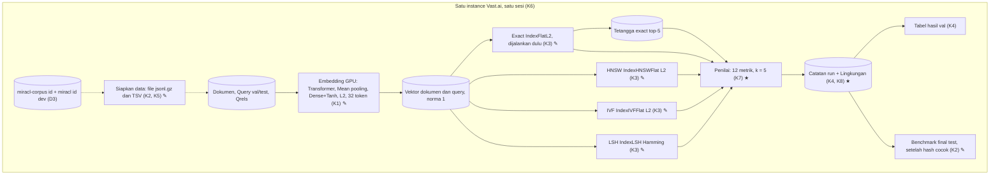

# 002a · MVP · Dataset, library, metrik

Disetujui: 2026-10-02
Produk: indonesian-retrieval-benchmark · Jenis: riset ML (benchmark algoritma pencarian vektor) · Data: tingkat 3, data riset publik lengkap (MIRACL id) dimuat di instance Vast.ai; mode data rahasia tidak aktif
Dasar: 001a (docs/rancangan/001a_2026-10-02_mvp-benchmark-retrieval.md)
Dokumen terkait: docs/keputusan-produk.md | docs/rencana-evaluasi.md (belum ada)

## Diagram alur



## Yang dirancang atau diubah

Dibanding 001a:

| Jenis | Bagian / keputusan | Sebelumnya | Sekarang |
|---|---|---|---|
| Diubah | Fase | MVP, lalu Dev | Satu fase berlabel MVP; tidak ada fase Dev |
| Diubah | D3 Sumber data | Belum dipilih | Korpus `miracl/miracl-corpus` id (1.446.315 passage); query dan qrels `miracl/miracl` id dev (960 query, 9.668 penilaian) |
| Diubah | K1 Pemakaian model | Library di 002 | sentence-transformers 6.1.0 hanya memuat; encode PyTorch lewat Transformer → Pooling mean → Dense+Tanh; max_length 32; `F.normalize` sekali; teks dokumen ditunda |
| Diubah | K2 Pembagian query | Test dibuka di benchmark final (Dev) | Benchmark final test = notebook terakhir fase MVP, dibuka sekali setelah konfigurasi dikunci dari val (hash) dan Lingkungan cocok |
| Diubah | K3 Bagian algoritma | Library dan LSH di 002 | faiss-cpu 1.15.1: IndexFlatL2, IndexHNSWFlat (L2), IndexIVFFlat (quantizer IndexFlatL2), IndexLSH (Hamming) |
| Diubah | K4 Catatan run | Kolom metrik di 002 | 12 metrik K7 + kolom diagnostik query dengan hasil < 5 + jumlah thread |
| Baru | K5 Pemuatan dataset | — | datasets 5.0.1 dari file: builder `json` untuk jsonl.gz, builder `csv` pemisah tab untuk TSV; revision dicatat |
| Baru | K6 Tempat menjalankan | — | Vast.ai Linux, RTX 3090 24 GB, RAM ≥ 32 GB, CPU ≥ 24, disk 50 GB; GPU hanya embedding; thread = min(jatah cgroup, 24) |
| Baru | K7 Metrik evaluasi | — | 12 metrik, k = 5, latensi p50; aturan slot −1 |
| Baru | K8 Pencatatan resource | — | Isi entitas Lingkungan: otomatis oleh kode + manual Arya di README.md |
| Diubah | Model data | Kunci logis saja | Atribut diisi; aturan integritas norma 1, relevansi ≥ 1, split test |
| Bagian baru | Benchmark final | — | Notebook terakhir: periksa hash konfigurasi dan Lingkungan, buka test sekali |

Tidak berubah: D1, D2 (cakupan 001 sebagai dasar struktur), aturan pembagian K2 (50:50, seed 42, dikunci hash), entitas dan relasi model data 001a.

Tidak dirancang (Belum pasti, dikerjakan di pekerjaan berikutnya): teks dokumen yang di-embed; parameter tiap algoritma; tanda berhasil benchmark; cara mengukur QPS, p50, dan ukuran index; penanganan jarak exact = 0; presisi dan batch encode; format berkas fisik; versi Python pasti (3.10–3.13); tempat penyimpanan di luar Vast.ai; perilaku pencatatan resource di luar Linux; grafik laporan.

## Rincian engineering

```
K1 · Embedding encode loop (PyTorch) — Umum [S1, S11]
Pendekatan   sentence-transformers 6.1.0 hanya memuat model (revision dicatat);
             encode dengan loop PyTorch sendiri melewati ketiga modul:
             Transformer → Pooling (mean tokens) → Dense 768→768 + Tanh
Parameter    tokenisasi max_length = 32 (dokumen dan query); dim 768;
             normalisasi L2 sekali dengan F.normalize saat encode
Aturan       Vektor tersimpan sudah bernorma 1; notebook search tidak
             menormalisasi lagi. Embedding sekali di GPU
Belum pasti  Teks dokumen (title + text atau text saja); presisi fp32/fp16;
             ukuran batch; pemeriksaan kesamaan dengan model.encode
```

```
K2 · Query split dan final benchmark — Umum
Pendekatan   Random split 960 query dev val/test 50:50, korpus tidak dibagi
Parameter    seed = 42; split dikunci dengan hash isi
Alur         Pemilihan konfigurasi hanya di val → konfigurasi dikunci ke
             berkas (cap waktu + hash isi) → notebook benchmark final
             (terakhir di fase MVP) berhenti kalau hash atau Lingkungan
             tidak cocok → buka test sekali
```

```
K3 · FAISS index — Umum [S5, S6, S8]
Library      faiss-cpu 1.15.1 (MIT, Meta), search di CPU
Exact        IndexFlatL2 — dijalankan lebih dulu, menjadi Tetangga exact
HNSW         IndexHNSWFlat, METRIC_L2
IVF          IndexIVFFlat, quantizer IndexFlatL2, METRIC_L2
LSH          IndexLSH — proyeksi acak → kode biner → jarak Hamming
Rumus        Vektor bernorma 1: ‖q − x‖² = 2 − 2·q·x → urutan L2 = urutan cosine
Belum pasti  M, efConstruction, efSearch; nlist, nprobe, data latih; nbits
```

```
K5 · Dataset loading from files — Umum [S10, S12]
Library      datasets 5.0.1 (tidak mendukung loading script miracl.py)
Korpus       miracl-corpus-v1.0-id, 3 file docs-*.jsonl.gz, builder "json"
             (atau konversi Parquet Hugging Face); kolom docid, title, text
Query/qrels  miracl-v1.0-id topics/*.tsv dan qrels/*.tsv (TREC), split dev,
             builder "csv" dengan pemisah tab
Aturan       Revision dataset dicatat di Set embedding dan Lingkungan
```

```
K6 · Execution environment — Umum
Tempat       Vast.ai (Linux); satu instance, satu sesi untuk keempat algoritma
Spesifikasi  GPU RTX 3090 24 GB · RAM ≥ 32 GB · CPU ≥ 24 (jatah efektif vCPU,
             angka pertama "x/y CPU") · disk 50 GB
Peran        GPU hanya embedding; search di CPU (faiss-cpu)
Thread       n = ⌊min(jatah CPU dari cgroup, 24)⌋, diset eksplisit lewat
             faiss.omp_set_num_threads(n) dan torch.set_num_threads(n),
             dicatat di setiap run; os.cpu_count() tidak dipakai
Aturan       Vektor dan hasil disalin keluar sebelum instance dihapus
             (tempat penyimpanan Belum pasti)
```

```
K7 · Evaluation metrics — Umum
k            5 untuk semua algoritma; latensi p50
Notasi       Rel(q) = dokumen relevance ≥ 1; relᵢ = 1 kalau hasil ke-i ∈ Rel(q);
             slot −1 → relᵢ = 0
1  nDCG@5        = DCG@5 / IDCG@5;  DCG@5 = Σᵢ₌₁⁵ relᵢ / log₂(i + 1)
                   IDCG@5 = DCG@5 dengan min(|Rel(q)|, 5) relevan di atas
2  Recall@5      = |Top5 ∩ Rel(q)| / |Rel(q)|
3  MRR@5         = 1 / peringkat relevan pertama di top-5; 0 kalau tidak ada
4  Precision@5   = |Top5 ∩ Rel(q)| / 5
5  MAP@5         = rata-rata AP@5;
                   AP@5 = (1 / min(|Rel(q)|, 5)) · Σᵢ₌₁⁵ P@i · relᵢ
6  Hit rate@5    = 1 kalau |Top5 ∩ Rel(q)| ≥ 1, selain itu 0
7  k-NN Recall@5 = |ANN₅(q) ∩ Exact₅(q)| / 5
8  Rel. distance error = (1/5) · Σᵢ₌₁⁵ (dᴬᴺᴺ₍ᵢ₎ − dᴱˣᵢ) / dᴱˣᵢ
                   d = √(skor L2 kuadrat FAISS)
                   LSH: d = ‖q − xᵢ‖₂ dihitung ulang dari vektor asli
                   dᴬᴺᴺ₍ᵢ₎ = jarak ke-i setelah lima jarak ANN diurutkan menaik
                   slot −1: d = 2 (jarak L2 maksimum vektor bernorma 1)
9  QPS           = jumlah query diukur / total waktu cari (s)
10 Latensi p50   = median waktu cari per query (ms)
11 Waktu build/train index (s)
12 Ukuran index / memori
Slot −1      Metrik 1–7: tidak relevan / tidak cocok, pembagi tetap 5;
             #8: penalti jarak 2; jumlah query dengan hasil < 5 dicatat
             sebagai kolom diagnostik; −1 tidak boleh dipakai sebagai
             indeks array
Batas atas   960 query dev: Precision@5 ≤ 0,567, Recall@5 ≤ 0,953 (rata-rata)
Belum pasti  Cara ukur QPS/p50 (satu per satu atau batch, pemanasan);
             definisi #12 (byte serialisasi atau memori proses);
             dᴱˣᵢ = 0 pada #8; tanda berhasil benchmark
```

```
K8 · Resource logging — Umum
Otomatis     GPU: model, VRAM, driver, CUDA, puncak VRAM
             CPU: model, flag AVX2/AVX-512, jatah vCPU (cgroup cpu.max,
                  sched_getaffinity), total vCPU mesin
             RAM: jatah (cgroup memory.max), puncak RAM terpakai
             Disk: total dan sisa
             Thread FAISS dan torch; versi Python dan library;
             revision model dan dataset; timestamp sesi
Manual       Arya di README.md: ID penawaran/host, harga per jam,
             reliability, lokasi, status verified (dashboard Vast.ai)
```

| Pendekatan | Ditolak karena |
|---|---|
| WebFAQ (`michaeldinzinger/webfaq-test`) | Arya memilih dataset yang sudah proper: korpus, query, qrels terpisah dan dinilai manusia |
| MIRACL hard negatives versi MTEB | Ditolak Arya; korpus penuh dipakai |
| Memuat MIRACL lewat loading script `miracl.py` | Tidak didukung datasets 5.x |
| `model.encode` sentence-transformers untuk encode | Arya memilih loop PyTorch sendiri; sentence-transformers hanya memuat model |
| `os.cpu_count()` untuk jumlah thread | Di Vast.ai melaporkan total mesin, bukan jatah instance |
| Laptop lokal untuk embedding dan evaluasi | VRAM RTX 3050 4 GB dan RAM kosong sekitar 2 GB tidak cukup |
| Urutan Hamming asli LSH untuk #8 | Galat per peringkat bisa negatif dan tidak setara dengan algoritma lain (titik periksa 3) |
| Pembagi |Rel(q)| pada AP@5 | 15,2% query tidak bisa mencapai 1,0 (titik periksa 4) |
| Fase Dev terpisah | Koreksi Arya: cukup satu fase |

**Model data** (entitas dan relasi 001a tetap; atribut diisi):

| Entitas | Isi | Kunci | Relasi | Aturan integritas |
|---|---|---|---|---|
| Dokumen | doc_id (= `docid` MIRACL, skema "X#Y"), title, text | doc_id (natural) | 1─N Penilaian relevansi; 1─1 Vektor dokumen per set embedding | doc_id unik; tidak diubah setelah disiapkan |
| Query | query_id, text, split | query_id (natural) | 1─N Penilaian relevansi; 1─1 Vektor query; 1─N Tetangga exact | split ∈ {val, test}, 50:50 seed 42, dikunci hash; ≥ 1 dokumen relevan; test hanya dibaca notebook benchmark final setelah hash cocok |
| Penilaian relevansi | query_id, doc_id, relevance (qrels TREC dev) | (query_id, doc_id) | N─1 Query; N─1 Dokumen | Relevan kalau relevance ≥ 1; id yang tidak ada dibuang dan jumlahnya dicatat |
| Set embedding | embedding_id, model, revision model, revision dataset, max_seq_length 32, normalisasi L2, dim 768, teks dokumen (menunggu keputusan) | embedding_id (hash konfigurasi) | 1─N Vektor; 1─N Tetangga exact; 1─N Run | Konfigurasi berbeda → embedding_id baru; vektor lama tidak ditimpa |
| Vektor dokumen | float32[768] | (embedding_id, row_idx) | 1─1 Dokumen lewat urutan doc_id tersimpan | 1.446.315 baris; norma L2 = 1 wajib |
| Vektor query | float32[768] | (embedding_id, row_idx) | 1─1 Query | 960 baris; norma L2 = 1 wajib |
| Tetangga exact | embedding_id, query_id, rank 1–5, doc_id, skor L2 kuadrat | (embedding_id, query_id, rank) | N─1 Set embedding, Query, Dokumen | Hanya berlaku untuk embedding_id yang sama |
| Run | run_id, timestamp, embedding_id, env_id, algorithm, params, split, k = 5, thread FAISS, thread torch, 12 metrik, jumlah query hasil < 5 | run_id (surrogate) | N─1 Set embedding; N─1 Lingkungan | Hanya ditambah; algorithm ∈ {flat, hnsw, ivf, lsh}; split ∈ {val, test}; −1 tidak pernah disimpan sebagai doc_id |
| Lingkungan | Isi K8 | env_id (hash isi) | 1─N Run | Efisiensi hanya dibandingkan antar-run dengan env_id sama; notebook final memeriksa kesamaan dengan run val |

## Laporan rancangan

```
Produk: riset ML (benchmark algoritma pencarian vektor) — membandingkan exact
        search dengan HNSW, IVF, LSH untuk retrieval teks bahasa Indonesia, di
        atas vektor yang sama dari congen-indobert-base
Fase: MVP (satu-satunya fase project — koreksi Arya, titik periksa 1a)
Dasar: 001a (disetujui 2026-10-02) + hasil diskusi Arya dengan koordinator
       + jawaban titik periksa 002
Status: disetujui 2026-10-02

Gambaran sistem (✎ diubah/diisi dibanding 001a, ★ baru):
[miracl-corpus id   ┄┄→ Siapkan data (K2 ✎, K5 ★) ┄┄→ [Dokumen] [Query val/test]
 miracl id dev] ✎       file jsonl.gz + TSV                         [Qrels]
                                                                       │
                                                                       ▼
              Buat embedding (K1 ✎) — GPU RTX 3090
              PyTorch: Transformer → Mean pooling → Dense+Tanh → L2, 32 token
              (teks dokumen: diputuskan di pekerjaan berikutnya)
                                                                       │
                                                                       ▼
                             [Vektor dokumen] [Vektor query] (768, norma 1)
                                                                       │
       ┌────────────────┬────────────────┬─────────────────────────────┴┐
       ▼                ▼                ▼                              ▼
 Exact L2 (K3 ✎)   HNSW L2 (K3 ✎)   IVF L2 (K3 ✎)             LSH Hamming (K3 ✎)
 dijalankan dulu        │                │                 L2 dihitung ulang (K7)
       ├→ [Tetangga exact top-5]         │                              │
       ▼                ▼                ▼                              ▼
 ┌──────────────────────────────────────────────────────────────────────┐
 │ Penilai (K7 ★): 6 kualitas vs [Qrels] · 2 kesetiaan vs exact ·       │
 │                 4 efisiensi · k = 5 · slot −1 ditangani              │
 └──────────────────────────────────┬───────────────────────────────────┘
                                    ▼
 [Catatan run (K4 ✎) + Lingkungan (K8 ★)] → Tabel hasil val
                                    │
          konfigurasi dikunci dari val (hash) ──→ Benchmark final test (K2 ✎)
                                    │
                                    ▼
                         hasil disalin keluar instance
 ── satu instance Vast.ai, satu sesi (K6 ★): GPU untuk embedding, CPU untuk search ──

Keputusan — yang berubah dibanding 001a:
| # | Sebelumnya (001a) | Sekarang (002) |
| Fase | MVP, lalu Dev | Satu fase berlabel MVP; tidak ada fase Dev |
| D3 | Belum dipilih | miracl-corpus id 1.446.315 passage (Apache-2.0); miracl id
       dev 960 query, 9.668 penilaian, rata-rata 3,22 relevan (min 1, maks 13);
       test-a/test-b tidak dipakai; WebFAQ dan hard negatives MTEB ditolak |
| K1 | Library di 002 | sentence-transformers 6.1.0 hanya memuat (revision dicatat);
       encode loop PyTorch: Transformer → Pooling mean → Dense 768→768 + Tanh;
       max_length 32; F.normalize sekali; teks dokumen ditunda |
| K2 | Test di benchmark final (Dev) | Split 50:50 seed 42 tetap; test dibuka
       sekali di notebook benchmark final (terakhir di MVP) setelah konfigurasi
       dikunci dari val (cap waktu + hash) |
| K3 | Library dan LSH di 002 | faiss-cpu 1.15.1: IndexFlatL2, IndexHNSWFlat
       (L2), IndexIVFFlat (quantizer IndexFlatL2), IndexLSH (Hamming) |
| K4 | Kolom metrik di 002 | 12 metrik K7 + diagnostik query hasil < 5 + thread |
Baru: K5 pemuatan dataset dari file (datasets 5.0.1, builder json / csv tab);
K6 Vast.ai (RTX 3090 24 GB, RAM ≥ 32 GB, CPU ≥ 24, disk 50 GB; thread =
min(jatah cgroup, 24)); K7 12 metrik k = 5 p50; K8 pencatatan resource
otomatis + manual Arya di README.md.
Tidak berubah: D1, D2, aturan pembagian K2.

Rumus K7: lihat Rincian engineering di atas (sama persis).

Desain UI/UX: tidak berlaku (tidak ada antarmuka).

Model data:
[Dokumen] 1──N [Penilaian relevansi] N──1 [Query]
[Set embedding] 1──N [Vektor dokumen]   (1──1 [Dokumen])
[Set embedding] 1──N [Vektor query]     (1──1 [Query])
[Query] 1──N [Tetangga exact] N──1 [Dokumen]
[Set embedding] 1──N [Run] N──1 [Lingkungan]

Bentrokan:
1  Satu fase vs 001a K2 "benchmark final (Dev)" dan template riset → pilihan
   1a: benchmark final masuk MVP; 001a tidak diubah, dicatat di Riwayat
2  001a K1 "inner product = cosine" vs METRIC_L2 → vektor norma 1:
   ‖q − x‖² = 2 − 2·q·x, urutan sama; dicatat di Riwayat
3  Penalti 2 untuk slot −1 bergantung normalisasi → integritas norma 1
4  LSH terurut Hamming → pilihan 3a: jarak L2 diurutkan ulang menaik
5  #8 bagi nol kalau dᴱˣᵢ = 0 → Belum pasti
6  Teks dokumen belum diputuskan → embedding menunggu pekerjaan berikutnya
7  001a D4 menjanjikan tanda berhasil benchmark di 002 → Belum pasti
8  sentence-transformers 6.1.0 Python 3.10–3.13 → versi pasti Belum pasti
9  Kartu miracl-corpus mencontohkan loading script → K5 muat dari file
10 Penyimpanan Vast.ai tidak permanen vs catatan run lintas sesi → disalin
   keluar; tempat Belum pasti
11 Efisiensi hanya sah satu sesi → test sebaiknya di sesi yang sama; notebook
   final memeriksa Lingkungan
12 cgroup hanya Linux vs laptop Windows → Belum pasti
13 CLAUDE.md project "Belum diputuskan" menjadi usang → Arya memperbarui

Asumsi: relevan = relevance ≥ 1; k = 5 untuk semua algoritma; RAM ≥ 32 GB
cukup kalau index dibangun dan dilepas satu per satu (satu salinan vektor
korpus ≈ 4,44 GB); Exact memberi #7 = 1,0 dan #8 = 0 menurut definisi.

Belum pasti: teks dokumen (pekerjaan berikutnya); parameter tiap algoritma dan
sapuan; tanda berhasil benchmark; cara ukur QPS/p50; definisi #12; dᴱˣᵢ = 0;
presisi/batch/pemeriksaan encode; format berkas fisik; versi Python pasti;
penyimpanan di luar Vast.ai; perilaku di luar Linux; grafik laporan; lisensi
model; tujuan keluaran.

Riset: 0 pencarian, 3 halaman (PyPI sentence-transformers, PyPI datasets, kartu
miracl-corpus); sumber dilarang yang dilewati: 0. Tidak ditemukan teks berisi
perintah.

Data: tingkat 3 — data riset publik lengkap (MIRACL id) dimuat di instance
Vast.ai; bukan data pengganti; mode data rahasia: tidak aktif.
```

## Titik periksa dan pilihan Arya

1. [Fase] Bagaimana koreksi "Cukup 1 fase saja" diterapkan?
   a. Satu fase berlabel MVP; benchmark final di split test ikut di fase ini sebagai notebook terakhir, dibuka sekali setelah konfigurasi dikunci dari val (Usulan) ✓ 2026-10-02
   b. Satu fase berlabel MVP; parameter ditetapkan di awal tanpa tuning, split val/test dihapus, dan 960 query dipakai sekali
2. [Teks dok] Teks dokumen apa yang di-embed?
   a. title + " " + text (Usulan)
   b. text saja
   Jawaban Arya: "Simpan keputusan ini untuk diputuskan dipekerjaan selanjutnya" ✓ 2026-10-02
3. [RDE LSH] Jarak L2 lima hasil LSH dibandingkan per peringkat dalam urutan apa?
   a. Diurutkan ulang menaik berdasarkan jarak L2 sebelum dibandingkan (Usulan) ✓ 2026-10-02
   b. Urutan Hamming asli dari LSH
4. [MAP@5] Pembagi Z pada AP@5 per query?
   a. min(|Rel(q)|, 5) (Usulan) ✓ 2026-10-02
   b. |Rel(q)|
   c. Jumlah relevan yang ditemukan di top-5

## Koreksi selama putaran

- Keputusan dataset, library, metrik, tempat menjalankan, dan pencatatan resource berasal dari diskusi Arya dengan koordinator (keputusan Arya, bukan usulan red-chan).
- Koreksi Arya dari putaran 001 yang masih terbuka: "Cukup 1 fase saja untuk proyek ini" — diterapkan lewat titik periksa 1a.
- Teks dokumen: "Simpan keputusan ini untuk diputuskan dipekerjaan selanjutnya".
- Persetujuan plan tanpa koreksi tambahan.

## Perintah untuk pink-chan
pink-chan, susun rencana pembangunan dari docs/rancangan/002a_2026-10-02_mvp-dataset-library-metrik.md
