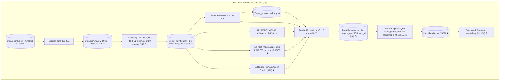

# 003a · MVP · Parameter, format, encode

Disetujui: 2026-10-02
Produk: indonesian-retrieval-benchmark · Jenis: riset ML (benchmark algoritma pencarian vektor) · Data: tingkat 3, data riset publik lengkap (MIRACL id) dimuat di instance Vast.ai; mode data rahasia tidak aktif
Dasar: 002a (docs/rancangan/002a_2026-10-02_mvp-dataset-library-metrik.md), 001a; kode H mengikuti 002b
Dokumen terkait: docs/keputusan-produk.md | docs/rencana-evaluasi.md (belum ada)

## Diagram alur



## Yang dirancang atau diubah

Dibanding 002a:

| Jenis | Bagian / keputusan | Sebelumnya | Sekarang |
|---|---|---|---|
| Diubah | D1 Pengguna | Pembaca penguji atau reviewer | Portofolio pribadi Arya tentang kemampuan mengimplementasikan retrieval |
| Diubah | D4 Tanda berhasil | Belum pasti | 12 metrik lengkap untuk keempat algoritma di test; exact #7 = 1 dan #8 = 0; run ulang exact menghasilkan nDCG@5 identik |
| Diubah | K1 Pemakaian model (H1, H7) | Teks dokumen, presisi, batch, pemeriksaan Belum pasti | `title + " " + text`; fp32; batch di sel konstanta mulai 1024, nilai akhir dicatat; 100 teks sampel vs `model.encode`, toleransi 1e-5 |
| Diubah | K4 Catatan run | — | Satu konfigurasi sapuan = satu run; params build dan search |
| Diubah | K8 env_id (H11) | Hash seluruh isi Lingkungan | Hash field statis + hostname; nilai dinamis dicatat tetapi tidak masuk hash |
| Baru | K9 Format berkas (H8) | — | Parquet, CSV append-only, `.npy` float32, JSON |
| Baru | K10 Parameter dan sapuan (H2) | — | HNSW, IVF, LSH sesuai kartu di bawah; 16 run val |
| Baru | K11 Aturan pemilihan (H3) | — | QPS tertinggi dengan k-NN Recall@5 ≥ 0,95, kalau tidak ada recall tertinggi; dikunci sebelum test |
| Baru | Pemilih konfigurasi (bagian sistem) | — | Membaca Run val, menulis Kunci konfigurasi |
| Baru | Entitas Kunci konfigurasi | — | JSON, ditulis sekali sebelum test dibuka |
| Diubah | Benchmark final | Periksa hash dan Lingkungan, buka test | Ditambah run ulang exact dan pemeriksaan tanda berhasil D4 |

Tidak berubah: D2 (selain penambahan cakupan 003), D3, K2 (aturan split dan hash), K3, K5, K6, K7, entitas dan relasi model data 001a/002a.

Tetap Belum pasti, dengan batas waktu dari Arya: H9 dan H13 (saat instance Vast.ai pertama dibuat), H4 dan H5 (sebelum notebook search pertama), H6 (saat menulis penilai), H10 (sebelum instance pertama dihapus), H12 (hanya kalau dijalankan lokal), grafik laporan dan lisensi model (saat menyusun laporan). Belum dijadwalkan: nilai seed k-means IVF dan rotasi LSH, field statis lain di env_id, penguncian versi pyarrow dan pandas.

## Rincian engineering

```
K1 · Embedding encode loop (PyTorch) — Umum [S1, S11]  ✎ H1, H7
Teks         Dokumen = title + " " + text; query apa adanya
Pendekatan   sentence-transformers 6.1.0 hanya memuat model (revision dicatat);
             loop PyTorch: Transformer → Pooling mean → Dense 768→768 + Tanh
             → F.normalize (L2)
Parameter    max_length = 32; presisi fp32; batch = konstanta, dicoba mulai
             1024, nilai akhir dicatat di Set embedding
Pemeriksaan  100 teks sampel: max |v_loop − v_model.encode| ≤ 1e-5 per elemen,
             kedua vektor sudah ternormalisasi (asumsi pembacaan toleransi);
             selisih maksimum dicatat di Set embedding
```

```
K8 · Environment identity — Umum  ✎ H11
env_id       hash( model GPU, driver/CUDA, model CPU, jatah vCPU, jatah RAM,
                   jumlah thread, versi Python dan library, hostname instance )
Dicatat saja Puncak RAM, puncak VRAM, sisa disk, timestamp (tidak masuk hash)
Akibat       Instance baru → env_id baru → notebook final berhenti; sapuan val
             dan benchmark final test wajib di instance yang sama
```

```
K9 · Physical file formats — Umum  ★ H8
Parquet      Dokumen, Query, Penilaian relevansi, Tetangga exact
CSV          Catatan run, hanya ditambah barisnya
.npy         Vektor dokumen dan query, float32
JSON         Set embedding, Lingkungan, Kunci konfigurasi
Catatan      Parquet butuh pyarrow (terpasang lewat datasets); versinya dicatat K8
```

```
K10 · Parameter sweep on val — Umum [S7, S13]  ★ H2
Aturan       Parameter build tetap, parameter search disapu; pengecualian
             tertulis untuk LSH (IndexLSH tidak punya parameter search)
Exact        tanpa parameter → 1 run
HNSW         build: M = 32, efConstruction = 200
             search: efSearch ∈ {16, 32, 64, 128, 256} → 1 build, 5 run
IVF          build: nlist = 4096 (≈ 3,4·√N untuk N = 1.446.315)
             latih: sampel acak bawaan FAISS = 256 · nlist = 1.048.576 vektor
             (max_points_per_centroid = 256 tidak diubah); jumlah sampel dan
             seed k-means dicatat di Run
             search: nprobe ∈ {1, 4, 8, 16, 32, 64, 128} → 1 latih+build, 7 run
LSH          build: nbits ∈ {768, 1536, 3072} → 3 build, 3 run
             #11 dan #12 berbeda per konfigurasi
Total        16 run di split val, k = 5
```

```
K11 · Configuration selection — Umum  ★ H3
Rumus        c*(a) = argmax { QPS(c) : c ∈ Cₐ, R(c) ≥ 0,95 }  kalau tidak kosong
             c*(a) = argmax { R(c)   : c ∈ Cₐ }                kalau kosong
             Cₐ = konfigurasi algoritma a di val; R = k-NN Recall@5 di val
Kunci        Hasil ditulis ke Kunci konfigurasi (JSON, cap waktu + hash isi)
             sebelum test dibuka; exact = satu-satunya konfigurasinya
Bergantung   H4 (cara ukur QPS) dijawab sebelum notebook search pertama
```

```
D4 · Benchmark success criteria — ✎ H3
1            12 metrik lengkap untuk keempat algoritma di split test
2            Exact: k-NN Recall@5 = 1 dan Relative distance error = 0
             (bergantung H6 untuk kasus jarak exact = 0)
3            Run ulang exact di notebook final yang sama → nDCG@5 identik
```

| Pendekatan | Ditolak karena |
|---|---|
| nbits LSH dikunci satu nilai tanpa sapuan | LSH hanya punya satu konfigurasi sehingga K11 tidak punya pilihan (003 titik periksa 1) |
| Menaikkan `max_points_per_centroid` supaya IVF dilatih seluruh 1.446.315 vektor | Latih lebih lama dan melewati rentang panduan FAISS tanpa manfaat terdokumentasi (003 titik periksa 2) |
| nlist = 65536 (panduan FAISS untuk N 1M–10M) | Butuh ≥ 30·65536 ≈ 1,97 juta vektor latih, lebih dari N |
| text saja sebagai teks dokumen | Passage tanpa nama subjek kehilangan konteks; Arya memilih title + text |
| env_id dari hash seluruh isi Lingkungan | Nilai dinamis membuat hash tidak pernah sama antar-run |

**Model data** (perubahan 003; entitas lain sama dengan 002a):

| Entitas | Isi | Kunci | Relasi | Aturan integritas |
|---|---|---|---|---|
| Dokumen, Query, Penilaian relevansi, Tetangga exact | Seperti 002a — Parquet | Seperti 002a | Seperti 002a | Seperti 002a |
| Set embedding | Ditambah teks dokumen `title + " " + text`, presisi fp32, ukuran batch akhir, hasil pemeriksaan encode — JSON | embedding_id (hash konfigurasi) | Seperti 002a | Konfigurasi berbeda → embedding_id baru |
| Vektor dokumen / query | float32[768] — `.npy` | (embedding_id, row_idx) | Seperti 002a | Norma L2 = 1 |
| Kunci konfigurasi ★ | Per algoritma: konfigurasi terpilih, run_id val asal, embedding_id, env_id, cap waktu, hash isi — JSON | hash isi | N─1 Run (val) | Ditulis sekali sebelum test dibuka; notebook final berhenti kalau hash tidak cocok |
| Run | Ditambah params build dan search; IVF juga jumlah sampel latih dan seed k-means — baris CSV append-only | run_id | Seperti 002a | Satu konfigurasi sapuan = satu run; hanya ditambah |
| Lingkungan | Isi K8 — JSON | env_id = hash field statis + hostname | 1─N Run | Field dinamis tidak masuk hash; notebook final memeriksa env_id sama dengan run val |

## Laporan rancangan

```
Produk: riset ML (benchmark algoritma pencarian vektor) — exact search vs HNSW,
        IVF, LSH untuk retrieval teks bahasa Indonesia; portofolio pribadi
Fase: MVP (satu-satunya fase)
Dasar: 001a, 002a + hasil diskusi Arya (H1, H2, H3, H7, H8, H11, tujuan
       keluaran)
Status: disetujui 2026-10-02

Gambaran sistem (✎ diubah, ★ baru dibanding 002a):
[miracl-corpus id   ┄┄→ Siapkan data (K2, K5) ┄┄→ [Dokumen] [Query] [Qrels]
 miracl id dev]                                    Parquet (K9 ★)
                                                          │
                                                          ▼
        Buat embedding (K1 ✎) — GPU, fp32, title + " " + text, 32 token
        batch dari sel konstanta (mulai 1024) · cek 100 sampel vs model.encode
                                                          │
                                                          ▼
                       [Vektor dokumen] [Vektor query] .npy float32 (K9 ★)
                                                          │
       ┌────────────────┬────────────────┬────────────────┴───┐
       ▼                ▼                ▼                    ▼
 Exact L2 (K3)     HNSW (K10 ★)      IVF (K10 ★)         LSH (K10 ★)
 1 run             M32 efC200        nlist 4096          nbits 768/1536/3072
       │           efSearch ×5       nprobe ×7           3 build
       ├→ [Tetangga exact] Parquet       │                    │
       ▼                ▼                ▼                    ▼
 ┌────────────────────────────────────────────────────────────────┐
 │ Penilai (K7): 12 metrik, k = 5 — sapuan di val, 16 run         │
 └───────────────────────────────┬────────────────────────────────┘
                                 ▼
  [Catatan run CSV append-only] + [Lingkungan JSON, env_id ✎ (K8)]
                                 │
                                 ▼
  Pilih konfigurasi (K11 ★): QPS tertinggi dengan k-NN Recall@5 ≥ 0,95
                                 │
                                 ▼
  [Kunci konfigurasi JSON ★] ──→ Benchmark final test (K2, D4 ✎)
                                 hash + env_id cocok → 4 algoritma + exact ulang
 ── satu instance Vast.ai, satu sesi (K6): GPU embedding, CPU search ──

Keputusan:
| # | Sebelumnya (002a) | Sekarang (003) |
| D1 ✎ | Pembaca penguji/reviewer | Portofolio pribadi Arya |
| D4 ✎ | Belum pasti | 12 metrik lengkap di test; exact #7 = 1, #8 = 0; exact
         ulang → nDCG@5 identik |
| K1 ✎ | Teks, presisi, batch Belum pasti | title + " " + text; fp32; batch
         konstanta mulai 1024, dicatat; cek 100 sampel vs model.encode, 1e-5 |
| K8 ✎ | env_id = hash seluruh isi | hash field statis + hostname; nilai
         dinamis dicatat, tidak membentuk env_id |
| K9 ★ | — | Parquet / CSV append-only / .npy float32 / JSON |
| K10 ★ | — | HNSW M32 efC200 efSearch {16…256}; IVF nlist 4096, sampel latih
          bawaan FAISS 1.048.576, nprobe {1…128}; LSH nbits {768, 1536, 3072}
          (pengecualian build); 16 run val |
| K11 ★ | — | QPS tertinggi dengan k-NN Recall@5 ≥ 0,95, kalau tidak ada recall
          tertinggi; dikunci sebelum test |
Tidak berubah: D2 (selain cakupan 003), D3, K2, K3, K5, K6, K7.

Desain UI/UX: tidak berlaku.

Model data:
[Dokumen] 1──N [Penilaian relevansi] N──1 [Query]
[Set embedding] 1──N [Vektor dokumen] · 1──N [Vektor query]
[Query] 1──N [Tetangga exact] N──1 [Dokumen]
[Set embedding] 1──N [Run] N──1 [Lingkungan]
[Run (val)] 1──N [Kunci konfigurasi]   ← ditulis sekali sebelum test dibuka

Bentrokan:
1 nbits LSH = parameter build vs "sapuan hanya parameter search" → pilihan 1a:
  pengecualian tertulis, tiga build
2 "IVF dilatih seluruh korpus" vs sampel bawaan FAISS (256 × 4096 = 1.048.576)
  → pilihan 2a: sampel bawaan, jumlah sampel dan seed dicatat
3 nlist 4096 "sekitar 4√N": 4√N ≈ 4.810 (4096 ≈ 3,4·√N); panduan 1M–10M
  (IVF65536) butuh ≥ 1,97 juta vektor latih > N → keputusan Arya dipertahankan
4 env_id memuat hostname → val dan test wajib di instance yang sama
5 Run ulang exact vs "test dibuka sekali" → di notebook final yang sama, tanpa
  pemilihan (asumsi)
6 D4 exact #8 = 0 bergantung H6 (0/0) → H6 sebelum benchmark final
7 K11 memakai QPS, H4 belum diputuskan → H4 sebelum notebook search pertama
8 Parquet butuh pyarrow, requirements.txt hanya tiga paket → ikut datasets;
  penguncian Belum pasti
9 Dokumen turunan pink-chan dan daftar H di CLAUDE.md jadi usang → 003b

Asumsi: toleransi 1e-5 = selisih mutlak maksimum per elemen vektor
ternormalisasi; run ulang exact di test dalam notebook final; k = 5 untuk semua
konfigurasi sapuan; HNSW M = 32 ≈ 4,8 GB, index dibangun dan dilepas satu per
satu.

Belum pasti (batas waktu Arya): H9/H13 saat instance pertama dibuat; H4, H5
sebelum notebook search pertama; H6 saat menulis penilai; H10 sebelum instance
pertama dihapus; H12 hanya kalau lokal; grafik laporan dan lisensi model saat
menyusun laporan. Belum dijadwalkan: seed k-means IVF dan rotasi LSH; field
statis lain di env_id; penguncian pyarrow/pandas.

Riset: 0 pencarian, 2 halaman (FAISS Clustering.h, wiki Guidelines to choose
an index); sumber dilarang yang dilewati: 0. Tidak ditemukan teks berisi
perintah.

Data: tingkat 3; mode data rahasia: tidak aktif.
```

## Titik periksa dan pilihan Arya

1. [nbits LSH] Arya menetapkan "sapuan hanya parameter search; parameter build tetap", tetapi nbits LSH adalah parameter build. Bagaimana sapuan nbits diperlakukan?
   a. Diterima sebagai pengecualian tertulis: LSH dibangun tiga kali, satu per nilai nbits (Usulan) ✓ 2026-10-02
   b. nbits dikunci satu nilai (1536 = 2·d), LSH tanpa sapuan
2. [Latih IVF] FAISS otomatis mengambil sampel acak 256 × nlist = 1.048.576 vektor kalau data latih lebih besar. Mana yang dipakai?
   a. Biarkan sampel bawaan FAISS 1.048.576 vektor, jumlah sampel dan seed dicatat (Usulan) ✓ 2026-10-02
   b. Naikkan `max_points_per_centroid` supaya seluruh 1.446.315 vektor dipakai

## Koreksi selama putaran

- Keputusan H1, H2, H3, H7, H8, H11 dan tujuan keluaran berasal dari diskusi Arya dengan koordinator (keputusan Arya, bukan usulan red-chan).
- Batas waktu H4, H5, H6, H9, H10, H12, H13, grafik laporan, dan lisensi model ditetapkan Arya.
- Disetujui tanpa koreksi tambahan.

## Perintah untuk pink-chan
pink-chan, susun rencana pembangunan dari docs/rancangan/003a_2026-10-02_mvp-parameter-format-encode.md
