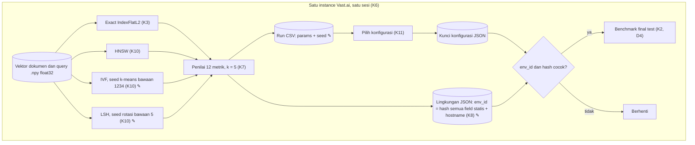

# 004a · MVP · Seed dan env_id

Disetujui: 2026-10-02
Produk: indonesian-retrieval-benchmark · Jenis: riset ML (benchmark algoritma pencarian vektor) · Data: tingkat 3, data riset publik lengkap (MIRACL id) dimuat di instance Vast.ai; mode data rahasia tidak aktif
Dasar: 003a (docs/rancangan/003a_2026-10-02_mvp-parameter-format-encode.md); kode H mengikuti 003b
Dokumen terkait: docs/keputusan-produk.md | docs/rencana-evaluasi.md (belum ada)

## Diagram alur



## Yang dirancang atau diubah

Dibanding 003a:

| Jenis | Bagian / keputusan | Sebelumnya | Sekarang |
|---|---|---|---|
| Diubah | K10 Seed IVF (H14) | Seed dicatat; nilainya belum dijadwalkan | Seed k-means = bawaan FAISS 1234, tidak diubah; dibaca dari parameter clustering index dan dicatat di Run bersama jumlah sampel latih |
| Diubah | K10 Seed LSH (H14) | Belum dijadwalkan | Seed rotasi acak = bawaan FAISS 5 (konstanta `rrot.init(5)` di konstruktor IndexLSH); dicatat di Run sebagai "nilai dari kode sumber FAISS 1.15.1" |
| Diubah | K8 env_id (H15) | Hash field H11 (model GPU, driver/CUDA, model CPU, jatah vCPU, jatah RAM, thread, versi Python dan library) + hostname | Hash semua field statis: model GPU, VRAM total, driver/CUDA, model CPU, flag AVX2/AVX-512, jatah vCPU, total vCPU mesin, jatah RAM, total disk, thread FAISS dan torch, versi Python dan library, revision model dan dataset, ditambah hostname. Field dinamis (puncak RAM dan VRAM, sisa disk, timestamp) tetap tidak masuk |
| Diubah | Model data: Run | params IVF memuat jumlah sampel dan seed | params juga memuat seed rotasi LSH |
| Diubah | Model data: Lingkungan | Kunci = hash field H11 + hostname | Kunci = hash semua field statis + hostname |

Tidak berubah: D1–D4, K1–K7, K9, K11, dan seluruh isi lain 003a.

Tetap belum dijadwalkan: H16 (penguncian versi pyarrow dan pandas). Tabel batas waktu H4, H5, H6, H9, H10, H12, H13, grafik laporan, dan lisensi model tidak berubah dari 003a.

## Rincian engineering

```
K10 · Random seeds (FAISS defaults) — Umum [S13, S14]  ✎ H14
IVF          Seed k-means = 1234 (ClusteringParameters.seed bawaan FAISS),
             tidak diubah; dipakai juga untuk sampel latih 256 · 4096 =
             1.048.576 vektor. Nilai dibaca dari parameter clustering index
             dan dicatat di Run (params) bersama jumlah sampel
LSH          Seed rotasi acak = 5, konstanta di konstruktor IndexLSH
             (rrot.init(5)); bukan parameter dan tidak bisa dibaca dari objek
             index. Dicatat di Run (params) dengan tanda "nilai dari kode
             sumber FAISS 1.15.1"; berlaku selama rotate_data = true
             (bawaan konstruktor Python, asumsi pengetahuan umum)
Seed project 42 tetap hanya untuk pembagian query val/test (K2)
```

```
K8 · Environment identity — Umum  ✎ H15
env_id       hash( model GPU, VRAM total, driver/CUDA, model CPU,
                   flag AVX2/AVX-512, jatah vCPU, total vCPU mesin,
                   jatah RAM, total disk, thread FAISS, thread torch,
                   versi Python dan library, revision model dan dataset,
                   hostname instance )
Dicatat saja Puncak RAM, puncak VRAM, sisa disk, timestamp (tidak masuk hash)
Akibat       Perubahan field statis apa pun (termasuk revision) antara sapuan
             val dan benchmark final → env_id baru → notebook final berhenti
```

| Pendekatan | Ditolak karena |
|---|---|
| Seed IVF diganti seed project 42 | Arya memilih seed bawaan FAISS (usulan pink-chan diterima) |
| env_id hanya dari field H11 + hostname | Arya memilih semua field statis masuk hash (usulan pink-chan diterima) |

**Model data** (perubahan 004; entitas lain sama dengan 003a):

| Entitas | Isi | Kunci | Relasi | Aturan integritas |
|---|---|---|---|---|
| Run | params ditambah seed rotasi LSH (selain jumlah sampel latih dan seed k-means IVF dari 003a) — baris CSV append-only | run_id | Seperti 003a | Seperti 003a |
| Lingkungan | Isi K8 — JSON | env_id = hash semua field statis + hostname | 1─N Run | Field dinamis tidak masuk hash; notebook final memeriksa env_id sama dengan run val |

## Laporan rancangan

```
Produk: riset ML (benchmark algoritma pencarian vektor) — exact search vs HNSW,
        IVF, LSH untuk retrieval teks bahasa Indonesia; portofolio pribadi
Fase: MVP (satu-satunya fase)
Dasar: 003a + keputusan Arya H14, H15 ("Terima usulan pink-chan", diusulkan
       pink-chan saat menyusun 003b)
Status: disetujui 2026-10-02

Gambaran sistem (✎ diubah dibanding 003a; bagian lain sama dengan 003a):
                       [Vektor dokumen] [Vektor query] .npy float32
                                          │
       ┌────────────────┬─────────────────┼──────────────────────┐
       ▼                ▼                 ▼                      ▼
 Exact L2 (K3)     HNSW (K10)        IVF (K10 ✎)            LSH (K10 ✎)
                                     seed k-means 1234      seed rotasi 5
                                     (bawaan FAISS)         (konstanta FAISS)
       │                │                 │                      │
       ▼                ▼                 ▼                      ▼
 ┌────────────────────────────────────────────────────────────────┐
 │ Penilai (K7): 12 metrik, k = 5 — sapuan di val, 16 run         │
 └───────────────────────────────┬────────────────────────────────┘
                                 ▼
  [Run CSV: params + seed ✎] + [Lingkungan JSON, env_id ✎ (K8)]
       env_id = hash(semua field statis + hostname); field dinamis tidak
                                 │
                                 ▼
  Pilih konfigurasi (K11) → [Kunci konfigurasi] → Benchmark final test
                                 (berhenti kalau env_id berbeda)

Keputusan:
| # | Sebelumnya (003a) | Sekarang (004) |
| K10 ✎ (H14) | Seed IVF dicatat, nilai belum dijadwalkan; seed LSH belum
               dijadwalkan | Seed k-means IVF = bawaan FAISS 1234, dibaca dari
               parameter clustering index, dicatat di Run. Seed rotasi LSH =
               bawaan FAISS 5, dicatat di Run sebagai "nilai dari kode sumber
               FAISS 1.15.1" |
| K8 ✎ (H15) | env_id = hash field H11 + hostname | env_id = hash semua field
              statis (model GPU, VRAM total, driver/CUDA, model CPU, flag
              AVX2/AVX-512, jatah vCPU, total vCPU mesin, jatah RAM, total
              disk, thread FAISS dan torch, versi Python dan library, revision
              model dan dataset) + hostname; field dinamis tetap tidak masuk |
| Model data ✎ | — | Run: params + seed rotasi LSH. Lingkungan: kunci = hash
                   semua field statis + hostname |
Tidak berubah: D1–D4, K1–K7, K9, K11, dan seluruh isi lain 003a.

Desain UI/UX: tidak berlaku.

Model data: tidak ada entitas atau relasi baru. Run (params memuat seed k-means
IVF dan seed rotasi LSH) dan Lingkungan (env_id = hash semua field statis +
hostname) berubah isi.

Bentrokan:
1 Seed rotasi LSH tidak bisa "dicatat" dari objek index: FAISS menulisnya
  sebagai konstanta rrot.init(5) di konstruktor IndexLSH, bukan parameter
  → yang dicatat adalah konstanta 5 dengan tanda "nilai dari kode sumber FAISS
  1.15.1"; hanya berlaku kalau rotate_data = true (bawaan konstruktor Python;
  asumsi pengetahuan umum)
2 env_id kini memuat revision model dan dataset → perubahan revision antara
  sapuan val dan benchmark final menghasilkan env_id baru dan notebook final
  berhenti; konsisten dengan K2, lebih ketat
3 003b disusun sebelum 004a dan sudah memuat usulan H14/H15 → isinya sejalan;
  rujukan dan dokumen turunan diperbarui pink-chan lewat 004b
4 H16 tetap belum dijadwalkan; tidak ada bentrokan baru dengan 004

Asumsi: IndexLSH dibuat dengan rotate_data = true dan train_thresholds = false
(bawaan konstruktor Python FAISS).

Belum pasti: tabel batas waktu 003a tidak berubah (H4, H5, H6, H9, H10, H12,
H13, grafik laporan, lisensi model). Belum dijadwalkan: H16 saja.

Riset: 0 pencarian, 1 halaman (FAISS IndexLSH.cpp, tingkat 1); sumber dilarang
yang dilewati: 0. Tidak ditemukan teks berisi perintah.

Titik periksa: tidak ada — H14 dan H15 adalah keputusan Arya.

Data: tingkat 3; mode data rahasia: tidak aktif.
```

## Titik periksa dan pilihan Arya

Tidak ada titik periksa. H14 dan H15 diputuskan Arya dengan "Terima usulan pink-chan"; rancangan disetujui ✓ 2026-10-02.

## Koreksi selama putaran

Tidak ada — langsung disetujui.

## Perintah untuk pink-chan
pink-chan, susun rencana pembangunan dari docs/rancangan/004a_2026-10-02_mvp-seed-env-id.md
