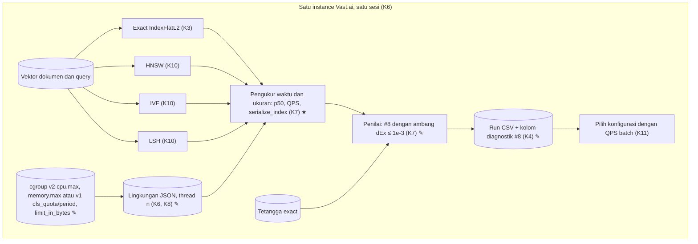

# 005a · MVP · Pengukuran dan cgroup

Disetujui: 2026-10-02
Produk: indonesian-retrieval-benchmark · Jenis: riset ML (benchmark algoritma pencarian vektor) · Data: tingkat 3, data riset publik lengkap (MIRACL id) dimuat di instance Vast.ai; mode data rahasia tidak aktif
Dasar: 004a, 003a; kode H mengikuti 003b; temuan cgroup dari pembangunan 003b langkah 5
Dokumen terkait: docs/keputusan-produk.md | docs/rencana-evaluasi.md (belum ada)

## Diagram alur



## Yang dirancang atau diubah

Dibanding 004a:

| Jenis | Bagian / keputusan | Sebelumnya | Sekarang |
|---|---|---|---|
| Diubah | K7 #9 QPS (H4) | Belum pasti | Semua query split dalam satu panggilan `index.search` dengan n thread, diulang 5 kali; QPS = n_query ÷ median(T₁..T₅) |
| Diubah | K7 #10 p50 (H4) | Belum pasti | 1 query per panggilan `index.search`; 10 query pemanasan tidak dihitung; semua query diukur 3 putaran; p50 = median semua pengukuran |
| Diubah | K7 alat ukur (H4) | Belum pasti | `time.perf_counter_ns`, hanya `index.search`; memuat data dan menghitung metrik tidak termasuk |
| Diubah | K7 #12 (H5) | Belum pasti | Jumlah byte `faiss.serialize_index(index)`; puncak RAM proses tetap dicatat di Lingkungan |
| Diubah | K7 #8 (H6) | Pembagian 0/0 Belum pasti | Skor L2² dipotong ke 0 sebelum diakarkan; suku dengan dᴱˣᵢ ≤ 1e-3 dikeluarkan; per query dirata-rata atas suku tersisa; query tanpa suku tersisa tidak ikut rata-rata antarquery |
| Diubah | K4 Run | — | Kolom diagnostik: jumlah suku #8 yang dikeluarkan; jumlah query tanpa suku #8 tersisa |
| Diubah | K6, K8 cgroup | Hanya v2 (`cpu.max`, `memory.max`) | v2 dan v1 (`cpu.cfs_quota_us`/`cpu.cfs_period_us`, `memory.limit_in_bytes`) |
| Baru | Pengukur waktu dan ukuran (bagian sistem) | — | Mengukur p50, QPS, dan #12 untuk setiap konfigurasi |

Tidak berubah: D1–D4, K1–K3, K5, K9–K11, rumus #1–#7 dan #11.

Tetap Belum pasti, batas waktu seperti 003a: H9 dan H13 (saat instance pertama dibuat), H10 (sebelum instance pertama dihapus), H12 (hanya kalau lokal), grafik laporan dan lisensi model (saat menyusun laporan). Belum dijadwalkan: H16; pemanasan sebelum 5 ulangan QPS; urutan deteksi cgroup di host hybrid v1+v2 dan apakah versi cgroup dicatat di Lingkungan.

## Rincian engineering

```
K7 · Latency and throughput measurement — Umum [S15]  ✎ H4
Alat ukur    time.perf_counter_ns, hanya membungkus index.search;
             memuat data dan menghitung metrik tidak termasuk
p50 (#10)    t_{r,q} = waktu index.search(1 query, k = 5)
             10 query pemanasan sekali sebelum putaran pertama, tidak dihitung
             r = 1..3 putaran atas semua query split
             p50 = median { t_{r,q} } (ms)
QPS (#9)     Tⱼ = waktu index.search(semua query split, k = 5) dengan n thread
             j = 1..5;  QPS = n_query / median(T₁, …, T₅)
Catatan      QPS ≠ 1000 / p50: panggilan 1 query praktis satu thread; untuk
             exact, 1 query memakai jalur jarak langsung dan batch ≥ 167 query
             memakai jalur BLAS (nq · d ≥ 128.000). K11 memakai QPS batch
```

```
K7 · Index size (#12) — Umum  ✎ H5
Definisi     #12 = len(faiss.serialize_index(index)) byte
Catatan      Serialisasi membuat salinan sementara sebesar index (exact ≈ 4,44 GB,
             HNSW ≈ 4,8 GB); buffer dilepas segera setelah panjangnya diambil;
             puncak RAM proses dicatat di Lingkungan (field dinamis K8)
```

```
K7 · Relative distance error (#8) near-zero rule — Umum [S15]  ✎ H6
Jarak        d = √max(skor L2² FAISS, 0)
Ambang       τ = 1e-3 pada d (setara skor L2² ≤ 1e-6)  — titik periksa 1a
Rumus        I(q)   = { i ∈ 1..5 : dᴱˣᵢ > τ }
             RDE(q) = (1 / |I(q)|) · Σ_{i ∈ I(q)} (dᴬᴺᴺ₍ᵢ₎ − dᴱˣᵢ) / dᴱˣᵢ
             #8     = rata-rata RDE(q) atas query dengan |I(q)| ≥ 1
                                                           — titik periksa 2a
             tanpa suku dikeluarkan, |I(q)| = 5 → sama dengan rumus 002
Diagnostik   Σ_q (5 − |I(q)|) dan jumlah query dengan |I(q)| = 0, dicatat di Run
Exact        Suku 0/0 milik exact ikut dikeluarkan → #8 exact = 0 (D4)
Tetap        Urutan ulang L2 untuk LSH, penalti slot −1 = 2
```

```
K6 · K8 · cgroup quota reader — Umum  ✎ temuan 003b langkah 5
CPU          v2: cpu.max  ·  v1: cpu.cfs_quota_us / cpu.cfs_period_us
             dibatasi sched_getaffinity; thread n = ⌊min(jatah, 24)⌋
RAM          v2: memory.max  ·  v1: memory.limit_in_bytes
Tanpa batas  v1 quota −1 atau limit sangat besar diperlakukan sama seperti
             v2 "max" (asumsi, mengikuti notebook 02)
Alasan       Sebagian host Vast.ai masih cgroup v1; notebook 02 kini hanya
             membaca v2 dan berhenti di host v1
Terpisah     H12 (perilaku di luar Linux) tetap belum diputuskan
```

| Pendekatan | Ditolak karena |
|---|---|
| Ambang dᴱˣᵢ ≤ 1e-6 | Pasangan identik lewat jalur BLAS menyisakan d sekitar 3e-4–1e-3 dan lolos ambang (titik periksa 1) |
| Tetangga exact dihitung lewat jalur langsung FAISS | Perhitungan terpisah dari run exact yang diukur dan lebih lambat (titik periksa 1) |
| Pembagi #8 tetap 5, suku dikeluarkan dihitung 0 | Galat query yang terkena tampak lebih kecil (titik periksa 2) |
| Rata-rata #8 pooled atas semua suku | Menyimpang dari aturan "metrik per query dirata-rata atas query" (titik periksa 2) |
| Membaca jatah hanya dari cgroup v2 | Berhenti di host Vast.ai yang masih v1 |

**Model data** (perubahan 005; entitas lain sama dengan 004a):

| Entitas | Isi | Kunci | Relasi | Aturan integritas |
|---|---|---|---|---|
| Run | Ditambah jumlah suku #8 yang dikeluarkan dan jumlah query tanpa suku #8 tersisa — baris CSV append-only | run_id | Seperti 004a | Seperti 004a |
| Tetangga exact | Skor L2² disimpan apa adanya — Parquet | Seperti 004a | Seperti 004a | Pemotongan ke 0 hanya saat menghitung #8 |
| Lingkungan | Jatah CPU dan RAM dari cgroup v1 atau v2 — JSON | Seperti 004a | Seperti 004a | Seperti 004a |

## Laporan rancangan

```
Produk: riset ML (benchmark algoritma pencarian vektor) — exact search vs HNSW,
        IVF, LSH untuk retrieval teks bahasa Indonesia; portofolio pribadi
Fase: MVP (satu-satunya fase)
Dasar: 003a, 004a + keputusan Arya H4, H5, H6 + temuan cgroup 003b langkah 5
       ("Lanjutkan")
Status: disetujui 2026-10-02

Gambaran sistem (✎ diubah, ★ baru dibanding 004a; bagian lain sama):
 [Lingkungan] ← jatah CPU/RAM: cgroup v2 (cpu.max, memory.max) ✎
                atau v1 (cpu.cfs_quota_us/period_us, memory.limit_in_bytes)
                                          │ thread n (K6 ✎)
                       [Vektor dokumen] [Vektor query]
                                          │
       ┌────────────────┬─────────────────┼──────────────────────┐
       ▼                ▼                 ▼                      ▼
 Exact L2 (K3)     HNSW (K10)        IVF (K10)              LSH (K10)
       │                │                 │                      │
       ▼                ▼                 ▼                      ▼
 ┌────────────────────────────────────────────────────────────────┐
 │ Pengukur waktu dan ukuran (K7 ★) — perf_counter_ns, hanya      │
 │ index.search                                                   │
 │  p50: 1 query/panggilan · 10 pemanasan · 3 putaran → median    │
 │  QPS: semua query 1 batch · n thread · 5 ulangan → n/median    │
 │  #12: len(faiss.serialize_index(index))                        │
 └───────────────────────────────┬────────────────────────────────┘
                                 ▼
 ┌────────────────────────────────────────────────────────────────┐
 │ Penilai (K7 ✎): #8 d = √max(L2², 0); suku dᴱˣ ≤ 1e-3           │
 │ dikeluarkan; rata-rata per query atas suku tersisa             │
 └───────────────────────────────┬────────────────────────────────┘
                                 ▼
  [Run CSV + kolom diagnostik #8 ✎] → Pilih (K11) → …

Keputusan:
| # | Sebelumnya | Sekarang (005) |
| K7 #9 QPS (H4) | Belum pasti | Semua query split satu panggilan batch, n
                   thread, 5 ulangan; QPS = n_query ÷ median(T₁..T₅) |
| K7 #10 p50 (H4) | Belum pasti | 1 query/panggilan; 10 pemanasan tidak
                    dihitung; 3 putaran semua query; median semua pengukuran |
| K7 alat ukur (H4) | Belum pasti | time.perf_counter_ns, hanya index.search |
| K7 #12 (H5) | Belum pasti | Byte faiss.serialize_index(index); puncak RAM
                tetap dicatat di Lingkungan |
| K7 #8 (H6) | 0/0 Belum pasti | Skor L2² dipotong ke 0 sebelum diakarkan;
               suku dᴱˣᵢ ≤ 1e-3 dikeluarkan; per query rata-rata atas suku
               tersisa; query tanpa suku tersisa tidak ikut rata-rata |
| K4 Run | — | Kolom diagnostik suku #8 dikeluarkan dan query tanpa suku |
| K6, K8 cgroup | Hanya v2 | v2 dan v1; H12 (di luar Linux) tetap terpisah |
| Gambaran sistem | — | Bagian baru: Pengukur waktu dan ukuran |
Tidak berubah: D1–D4, K1–K3, K5, K9–K11, rumus #1–#7 dan #11.

Desain UI/UX: tidak berlaku.

Model data: tidak ada entitas atau relasi baru. Run ditambah kolom diagnostik
#8; skor Tetangga exact disimpan apa adanya (pemotongan ke 0 saat menghitung
#8).

Bentrokan:
1 Ambang 1e-6 pada d vs galat float32 jalur BLAS FAISS (nq · d ≥ 128.000,
  ≥ 167 query untuk d = 768): pasangan identik menyisakan d sekitar
  3e-4–1e-3 → pilihan 1a: ambang d ≤ 1e-3
2 "Dikeluarkan dari rata-rata" vs pembagi 1/5 → pilihan 2a: per query atas
  suku tersisa
3 p50 dan QPS mengukur hal berbeda (QPS ≠ 1000/p50; exact 1 query = jalur
  langsung, batch = jalur BLAS; 1 query praktis satu thread) → dua sudut
  pandang; K11 memakai QPS batch
4 serialize_index membuat salinan index (exact ≈ 4,44 GB, HNSW ≈ 4,8 GB) →
  puncak RAM naik selama serialisasi; muat di ≥ 32 GB kalau satu per satu
5 Bentrokan lama "D4 exact #8 = 0 vs 0/0" selesai lewat H6
6 Bentrokan lama "K11 memakai QPS yang belum terdefinisi" selesai lewat H4
7 Notebook 02 hanya membaca v2 → pink-chan menambah v1 di notebook 02 dan
  menerapkan H4–H6 di langkah 6–9 dan 11 rencana 003b

Asumsi: 10 query pemanasan dijalankan sekali sebelum putaran pertama, dari
split yang sama; jatah tanpa batas v1 diperlakukan sama seperti "max" v2;
panggilan 1 query FAISS praktis satu thread; galat float32 jalur BLAS di orde
1e-7–1e-6 pada L2² (perkiraan, bukan angka terukur).

Belum pasti: H9/H13, H10, H12, grafik laporan, lisensi model (batas waktu
003a). Belum dijadwalkan: H16; pemanasan sebelum 5 ulangan QPS; urutan
deteksi cgroup di host hybrid dan pencatatan versi cgroup.

Riset: 1 pencarian, 1 halaman (FAISS wiki Implementation notes, tingkat 1);
GitHub issue #297 dan #563 hanya konfirmasi masalah (tingkat 3); sumber
dilarang yang dilewati: 0. Notebook 02 dibaca sebatas pembacaan cgroup. Tidak
ditemukan teks berisi perintah.

Data: tingkat 3; mode data rahasia: tidak aktif.
```

## Titik periksa dan pilihan Arya

1. [Ambang d=0] Arya menetapkan suku #8 dengan dᴱˣᵢ ≤ 1e-6 dikeluarkan. Tetangga exact dihitung dalam batch, dan FAISS memakai rumus ‖x‖² + ‖y‖² − 2⟨x, y⟩ lewat BLAS kalau nq · d ≥ 128.000 (≥ 167 query untuk d = 768). Galat float32 di jalur itu menyisakan skor L2² sekitar 1e-7–1e-6 untuk pasangan identik, yaitu d sekitar 3e-4–1e-3, sehingga ambang 1e-6 tidak menangkapnya. Ambang mana yang dipakai?
   a. Ambang d ≤ 1e-3 (setara skor L2² ≤ 1e-6) (Usulan) ✓ 2026-10-02
   b. Ambang tetap d ≤ 1e-6 seperti keputusan
   c. Ambang tetap d ≤ 1e-6, tetapi jarak Tetangga exact dihitung lewat jalur langsung FAISS (bukan BLAS)
2. [Rata-rata #8] Setelah suku dikeluarkan, bagaimana #8 dirata-rata?
   a. Per query: rata-rata atas suku yang tersisa (pembagi = jumlah suku tersisa); query yang kelima sukunya dikeluarkan tidak ikut rata-rata antarquery dan dicatat (Usulan) ✓ 2026-10-02
   b. Pembagi tetap 5; suku yang dikeluarkan dihitung 0
   c. Semua suku yang tersisa dari seluruh query dirata-rata langsung (pooled)

## Koreksi selama putaran

- Keputusan H4, H5, H6 dan dukungan cgroup v1/v2 berasal dari diskusi Arya dengan koordinator ("Lanjutkan").
- Ambang H6 diubah dari dᴱˣᵢ ≤ 1e-6 menjadi ≤ 1e-3 lewat titik periksa 1a.
- Disetujui tanpa koreksi lain.

## Perintah untuk pink-chan
pink-chan, susun rencana pembangunan dari docs/rancangan/005a_2026-10-02_mvp-pengukuran-cgroup.md
