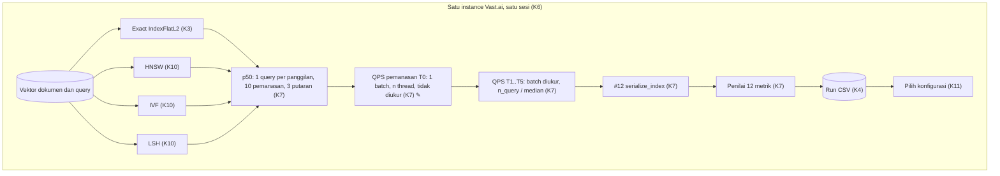

# 006a · MVP · Pemanasan QPS

Disetujui: 2026-10-03
Produk: indonesian-retrieval-benchmark · Jenis: riset ML (benchmark algoritma pencarian vektor) · Data: tingkat 3, data riset publik lengkap (MIRACL id) dimuat di instance Vast.ai; mode data rahasia tidak aktif
Dasar: 005a (docs/rancangan/005a_2026-10-02_mvp-pengukuran-cgroup.md); kode H17–H19 dari pink-chan saat menyusun 005b
Dokumen terkait: docs/keputusan-produk.md | docs/rencana-evaluasi.md (belum ada)

## Diagram alur



Urutan p50 → QPS → #12 di diagram hanya untuk keterbacaan; urutan langkah pengukuran di dalam satu konfigurasi tidak diputuskan di rancangan ini, kecuali T₀ tepat sebelum T₁..T₅.

## Yang dirancang atau diubah

Dibanding 005a:

| Jenis | Bagian / keputusan | Sebelumnya | Sekarang |
|---|---|---|---|
| Diubah | K7 #9 QPS (H17) | Pemanasan sebelum 5 ulangan QPS belum dijadwalkan | Satu panggilan batch pemanasan T₀ (semua query split, n thread) yang tidak diukur dijalankan sebelum T₁..T₅. Rumus QPS = n_query ÷ median(T₁..T₅) tidak berubah |
| Diubah | Gambaran sistem: Pengukur waktu dan ukuran | QPS dari 5 panggilan batch | QPS dari 1 panggilan pemanasan tidak diukur, lalu 5 panggilan batch yang diukur |
| Dicatat | H18 Urutan deteksi cgroup di host hybrid | Belum dijadwalkan (tanpa kode) | Tetap Belum pasti; perilaku sementara: notebook berhenti dengan error |
| Dicatat | H19 Versi cgroup di Lingkungan | Belum dijadwalkan (tanpa kode) | Tetap Belum pasti; perilaku sementara: tidak dicatat |

Tidak berubah: D1–D4, K1–K6, K8–K11, rumus #1–#8 dan #10–#12, model data.

Tetap Belum pasti, batas waktu seperti 003a: H9 dan H13, H10, H12, grafik laporan, lisensi model. Belum dijadwalkan dan tidak menahan langkah: H16, H18, H19.

## Rincian engineering

```
K7 #9 · QPS warm-up — Umum  ✎ H17
Pemanasan    T₀ = index.search(semua query split, k = 5) dengan n thread;
             tidak diukur, hasilnya tidak dipakai
Pengukuran   Tⱼ = waktu index.search(semua query split, k = 5) dengan n thread,
             j = 1..5, dijalankan setelah T₀; time.perf_counter_ns, hanya
             index.search
Rumus        QPS = n_query / median(T₁, …, T₅)   (tidak berubah dari 005a)
Frekuensi    Sekali per konfigurasi, tepat sebelum 5 ulangan QPS konfigurasi
             itu (asumsi: sapuan efSearch/nprobe mengganti parameter search
             pada index yang sama)
```

```
H18 · H19 · cgroup — Belum pasti, tidak menahan langkah
H18          Host hybrid (v1 dan v2 terpasang sekaligus): urutan deteksi belum
             diputuskan; sementara notebook berhenti dengan error, sebelum
             mengukur apa pun
H19          Versi cgroup dicatat di Lingkungan atau tidak: sementara tidak
             dicatat; kalau kelak dicatat, ia field statis dan ikut env_id (H15)
```

| Pendekatan | Ditolak karena |
|---|---|
| Tanpa pemanasan sebelum ulangan QPS | Arya memilih "1 batch tanpa diukur" |

## Laporan rancangan

```
Produk: riset ML (benchmark algoritma pencarian vektor) — exact search vs HNSW,
        IVF, LSH untuk retrieval teks bahasa Indonesia; portofolio pribadi
Fase: MVP (satu-satunya fase)
Dasar: 005a + keputusan Arya H17 ("1 batch tanpa diukur"); kode H17–H19 dari
       pink-chan saat menyusun 005b
Status: disetujui 2026-10-03

Gambaran sistem (✎ diubah dibanding 005a; bagian lain sama):
                       [Vektor dokumen] [Vektor query]
                                          │
       ┌────────────────┬─────────────────┼──────────────────────┐
       ▼                ▼                 ▼                      ▼
 Exact L2 (K3)     HNSW (K10)        IVF (K10)              LSH (K10)
       │                │                 │                      │
       ▼                ▼                 ▼                      ▼
 ┌────────────────────────────────────────────────────────────────┐
 │ Pengukur waktu dan ukuran (K7 ✎)                               │
 │  p50: 1 query/panggilan · 10 pemanasan · 3 putaran → median    │
 │  QPS: T₀ batch pemanasan (tidak diukur) ✎                      │
 │       → T₁..T₅ batch diukur · n thread → n_query / median      │
 │  #12: len(faiss.serialize_index(index))                        │
 └───────────────────────────────┬────────────────────────────────┘
                                 ▼
                      Penilai (K7) → [Run CSV] → Pilih (K11) → …

Keputusan:
| # | Sebelumnya (005a) | Sekarang (006) |
| K7 #9 QPS (H17) | Pemanasan sebelum 5 ulangan QPS belum dijadwalkan | Satu
                    panggilan batch pemanasan T₀ (semua query split, n thread)
                    tidak diukur sebelum 5 ulangan QPS; rumus QPS =
                    n_query ÷ median(T₁..T₅) tidak berubah |
| Gambaran sistem ✎ | — | Pengukur waktu dan ukuran memuat pemanasan T₀ |
Tidak berubah: D1–D4, K1–K6, K8–K11, rumus #1–#8 dan #10–#12, model data.

Desain UI/UX: tidak berlaku. Model data: tidak berubah (T₀ tidak dicatat,
tidak ada kolom baru).

Bentrokan:
1 H18: host hybrid cgroup v1+v2 → notebook sementara berhenti dengan error;
  tidak menahan langkah karena berhenti sebelum mengukur apa pun; risikonya
  instance harus diganti atau H18 diputuskan saat itu
2 H19: versi cgroup sementara tidak dicatat → konsisten dengan H15; kalau kelak
  dicatat, ia field statis dan ikut env_id
3 Tidak ada bentrokan H17 dengan keputusan 001–005

Asumsi: T₀ dijalankan sekali per konfigurasi, tepat sebelum 5 ulangan QPS
konfigurasi itu (sapuan efSearch dan nprobe mengganti parameter search pada
index yang sama).

Belum pasti: batas waktu 003a — H9/H13, H10, H12, grafik laporan, lisensi
model. Belum dijadwalkan (tidak menahan langkah): H16, H18 (sementara berhenti
dengan error), H19 (sementara tidak dicatat).

Riset: 0 pencarian, 0 halaman. Tidak ditemukan teks berisi perintah.

Titik periksa: tidak ada — H17 adalah keputusan Arya.

Data: tingkat 3; mode data rahasia: tidak aktif.
```

## Titik periksa dan pilihan Arya

Tidak ada titik periksa. H17 diputuskan Arya dengan "1 batch tanpa diukur"; rancangan disetujui ✓ 2026-10-03.

## Koreksi selama putaran

Tidak ada — langsung disetujui.

## Perintah untuk pink-chan
pink-chan, susun rencana pembangunan dari docs/rancangan/006a_2026-10-03_mvp-pemanasan-qps.md
