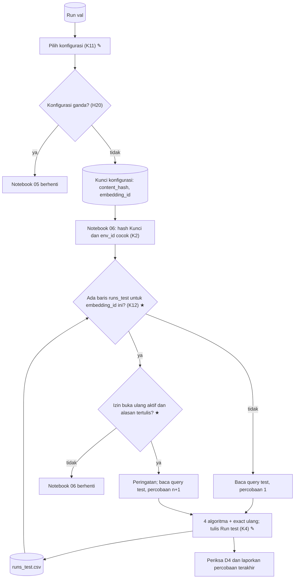

# 007a · MVP · Penjaga test

Disetujui: 2026-10-03
Produk: indonesian-retrieval-benchmark · Jenis: riset ML (benchmark algoritma pencarian vektor) · Data: tingkat 3, data riset publik lengkap (MIRACL id) dimuat di instance Vast.ai; mode data rahasia tidak aktif
Dasar: 006a, 003a; temuan pink-chan di 003b langkah 11; kode H mengikuti 003b–006b
Dokumen terkait: docs/keputusan-produk.md | docs/rencana-evaluasi.md (belum ada)

## Diagram alur



Di luar diagram: `requirements.txt` (K13 ★) = 3 paket 002a + torch, numpy (H13) + pyarrow, pandas (H16), semuanya `==` dari `pip freeze` instance yang sama.

## Yang dirancang atau diubah

Dibanding 006a:

| Jenis | Bagian / keputusan | Sebelumnya | Sekarang |
|---|---|---|---|
| Baru | K12 Penjaga test dan izin buka ulang | Notebook 06 bisa dijalankan ulang dan membuka test lagi | Sebelum query test dibaca: kalau `runs_test.csv` sudah berisi baris untuk embedding_id yang sama (apa pun Kunci-nya), notebook berhenti; kecuali izin buka ulang di sel konstanta aktif (bawaan mati) dengan alasan tertulis |
| Diubah | K4 Run | Baris test tidak menyimpan asal Kunci atau percobaan | Baris test menyimpan `config_lock_hash`, `test_attempt`, `reopen_reason` |
| Diubah | K2 | Berhenti kalau hash Kunci atau env_id tidak cocok | Ditambah penjaga K12; "test dibuka sekali" mendapat pengecualian tertulis lewat izin Arya |
| Diubah | D4 | — | Dinilai pada percobaan terakhir; setelah D4 gagal, buka ulang hanya lewat izin K12 |
| Diubah | K11 (H20) | — | Sementara notebook 05 berhenti kalau satu konfigurasi tercatat lebih dari sekali |
| Baru | K13 Penguncian dependency (H16) | 002a: tepat tiga paket | Ditambah torch, numpy, pyarrow, pandas `==` dari `pip freeze` instance yang sama |
| Baru | Bagian sistem Penjaga test, Laporan hasil test | — | Lihat Gambaran sistem di keputusan-produk.md |
| Diubah | Model data | — | Relasi Kunci konfigurasi 1─N Run (test); aturan integritas `test_attempt` dan `reopen_reason` |

Tidak berubah: D1–D3, K1, K3, K5–K10, rumus K7, dan K11 selain prasyarat H20.

Tetap Belum pasti: H9, H13, H16 (nilai versi; saat instance pertama dibuat), H10 (sebelum instance pertama dihapus), H12 (hanya kalau lokal), H20 (kalau kasusnya terjadi), grafik laporan dan lisensi model (saat menyusun laporan). Belum dijadwalkan: H18, H19.

## Rincian engineering

```
K12 · Test-split guard with explicit reopen — Umum
Tempat       Notebook 06, setelah hash Kunci cocok dan env_id cocok, sebelum
             query test dibaca. Hanya membaca runs_test.csv dan sel konstanta;
             tidak membaca data test
Kunci        E = embedding_id Kunci konfigurasi; P = baris runs_test.csv dengan
             embedding_id = E (apa pun config_lock_hash-nya)   — titik periksa 2a
Aturan       P = ∅                              → lanjut, test_attempt = 1
             P ≠ ∅, izin mati                   → berhenti (sebut jumlah
                                                  percobaan dan cap waktu)
             P ≠ ∅, izin aktif, alasan kosong   → berhenti
             P ≠ ∅, izin aktif, alasan ada      → cetak peringatan, lanjut,
                                                  test_attempt = max(P) + 1,
                                                  reopen_reason = alasan
                                                                 — titik periksa 1a
Sel konstanta  IZIN_BUKA_ULANG (bawaan mati) dan ALASAN_BUKA_ULANG (teks);
             Arya mengembalikan izin ke mati setelah percobaan selesai
Run test     config_lock_hash = content_hash Kunci; test_attempt sama untuk
             semua baris satu eksekusi; reopen_reason wajib kalau attempt > 1
Laporan      Baris dengan test_attempt terbesar untuk E; sebut jumlah
             percobaan dan alasannya. D4 dinilai pada percobaan terakhir
Append-only  Baris lama tidak diubah atau dihapus
```

```
K11 · Duplicate val configuration (H20) — sementara
Aturan       Setiap konfigurasi muncul tepat sekali di run val; kalau tidak,
             notebook 05 berhenti. Run mana yang dipakai diputuskan kalau
             kasusnya terjadi
```

```
K13 · Dependency pinning (H16) — Umum
requirements.txt  sentence-transformers==6.1.0, faiss-cpu==1.15.1,
                  datasets==5.0.1 (002a) + torch, numpy (H13) + pyarrow,
                  pandas (H16), semuanya == dari pip freeze instance Vast.ai
                  yang sama; Python dari python --version instance itu (H9)
Alasan       Parquet dan hash isi di notebook 01 dibaca dan ditulis dengan
             versi yang sama di setiap sesi
```

| Pendekatan | Ditolak karena |
|---|---|
| Penjaga hanya per `content_hash` (usulan pink-chan) | Kunci baru bisa membuka test lagi setelah hasil test terlihat (titik periksa 2) |
| Test terkunci permanen tanpa jalan buka ulang | Kesalahan penilai yang baru ketahuan setelah test dibuka tidak bisa diperbaiki tanpa putaran rancangan (titik periksa 1) |
| Hapus baris test lama secara manual | Melanggar catatan run hanya ditambah (K4) dan menghapus jejak (titik periksa 1) |
| `requirements.txt` tetap tiga paket | Versi pyarrow/pandas transitif bisa berbeda antar-sesi dan mengubah Parquet serta hash isi (H16) |

**Model data** (perubahan 007; entitas lain sama dengan 006a):

| Entitas | Isi | Kunci | Relasi | Aturan integritas |
|---|---|---|---|---|
| Run | Untuk split test ditambah `config_lock_hash`, `test_attempt`, `reopen_reason` — baris CSV append-only | run_id | N─1 Set embedding; N─1 Lingkungan; N─1 Kunci konfigurasi (test) | Baris lama tidak diubah atau dihapus; konfigurasi val unik (H20, sementara); `test_attempt` ≥ 1, sama untuk satu eksekusi notebook 06; `reopen_reason` wajib kalau `test_attempt` > 1 |
| Kunci konfigurasi | Seperti 006a | content_hash | N─1 Run (val); 1─N Run (test) lewat `config_lock_hash` | Ditulis sekali sebelum test dibuka |

## Laporan rancangan

```
Produk: riset ML (benchmark algoritma pencarian vektor) — exact search vs HNSW,
        IVF, LSH untuk retrieval teks bahasa Indonesia; portofolio pribadi
Fase: MVP (satu-satunya fase)
Dasar: 003a–006a + keputusan Arya ("Ya, lewat red-chan"; H20 "Terima
       sementara"; H16 "Ya, dikunci") + temuan pink-chan 003b langkah 11
Status: disetujui 2026-10-03

Gambaran sistem (✎ diubah, ★ baru dibanding 006a; bagian lain sama):
 [Run val] → Pilih konfigurasi (K11 ✎) ── konfigurasi ganda? ──ya──→ berhenti (H20)
                    │ tidak
                    ▼
            [Kunci konfigurasi]  content_hash, embedding_id
                    │
                    ▼
 Notebook 06: hash Kunci cocok? → env_id cocok? → Penjaga test (K12 ★)
                                                    │
         [runs_test.csv] ── ada baris untuk embedding_id ini? ──tidak──→ percobaan 1
                                                    │ ya
                                                    ▼
                      izin buka ulang aktif + alasan? ──tidak──→ berhenti
                                                    │ ya
                                                    ▼
                         peringatan → percobaan n+1, alasan dicatat
                                                    │
                                                    ▼
                       Baca query test → 4 algoritma + exact ulang
                                                    │
                                                    ▼
      [runs_test.csv] + baris baru: config_lock_hash, test_attempt,
                                     reopen_reason ✎ (K4)
                                                    │
                                                    ▼
                 Periksa D4 dan laporan: percobaan terakhir + jumlah percobaan

 requirements.txt (K13 ★): 3 paket 002a + torch, numpy (H13)
                         + pyarrow, pandas (H16) — semua ==, dari pip freeze
                           instance yang sama

Keputusan:
| K12 ★ | Penjaga test: berhenti sebelum query test dibaca kalau runs_test.csv
          sudah berisi baris untuk embedding_id yang sama (apa pun Kunci-nya);
          buka ulang hanya lewat IZIN_BUKA_ULANG (bawaan mati) + alasan
          tertulis; baris lama tetap; percobaan dinomori; laporan memakai
          percobaan terakhir dan menyebut jumlah percobaan |
| K4 ✎ | Run test: config_lock_hash, test_attempt, reopen_reason |
| K2 ✎ | Penjaga ditambah; "test dibuka sekali" mendapat pengecualian tertulis |
| D4 ✎ | Dinilai pada percobaan terakhir |
| K11 ✎ / H20 | Sementara notebook 05 berhenti kalau ada konfigurasi val ganda |
| K13 ★ | requirements.txt: + torch, numpy, pyarrow, pandas ==, dari pip
          freeze instance yang sama |
Tidak berubah: D1–D3, K1, K3, K5–K10, rumus K7.

Desain UI/UX: tidak berlaku.

Bentrokan:
1 D4 gagal / notebook terputus meninggalkan baris test → pilihan 1a: izin
  buka ulang tertulis, percobaan dinomori
2 Penjaga per content_hash bisa dilewati Kunci baru → pilihan 2a: diikat ke
  embedding_id
3 Konstanta izin bisa tertinggal aktif → peringatan dicetak, alasan dan nomor
  percobaan tercatat di setiap baris; Arya mengembalikannya ke mati (asumsi)
4 Penjaga bergantung pada runs_test.csv ikut disalin keluar instance (H10)
5 002a "tepat tiga paket" vs K13 → dicatat di Riwayat; versi baru ditulis
  setelah instance pertama ada
6 Exact ulang tidak bentrok dengan penjaga (diperiksa sebelum test dibaca)

Asumsi: runs_test.csv masih kosong saat 007 dibangun; Arya mengembalikan izin
buka ulang ke mati setelah dipakai.

Belum pasti: H9/H13/H16 (versi), H10, H12, H20, grafik laporan, lisensi model.
Belum dijadwalkan: H18, H19.

Riset: 0 pencarian, 0 halaman. notebooks/05 dan 06 dibaca sebatas
content_hash dan runs_test.csv. Tidak ditemukan teks berisi perintah.

Data: tingkat 3; mode data rahasia: tidak aktif.
```

## Titik periksa dan pilihan Arya

1. [Buka ulang] Kalau D4 gagal karena kesalahan kode, atau notebook terputus setelah test dibuka, apa jalan untuk membuka test lagi?
   a. Konstanta izin buka ulang di sel konstanta notebook 06 (bawaan mati), diaktifkan Arya bersama alasan tertulis; baris lama tetap, baris baru membawa nomor percobaan dan alasan, laporan memakai percobaan terakhir sambil menyebut jumlah percobaan (Usulan) ✓ 2026-10-03
   b. Tidak ada jalan buka ulang; perbaikan lewat rancangan baru red-chan
   c. Arya menghapus baris test lama secara manual lalu menjalankan ulang
2. [Kunci baru] Kunci konfigurasi baru akan lolos penjaga per `content_hash`. Mana aturannya?
   a. Penjaga berhenti kalau `runs_test.csv` berisi baris untuk embedding_id yang sama, apa pun Kunci-nya; buka ulang hanya lewat jalan titik periksa 1 (Usulan) ✓ 2026-10-03
   b. Sesuai usulan pink-chan: hanya `content_hash` yang sama

## Koreksi selama putaran

- Keputusan H16 ("Ya, dikunci") ditambahkan koordinator di tengah putaran dan dimasukkan sebagai K13.
- Disetujui tanpa koreksi lain.

## Perintah untuk pink-chan
pink-chan, susun rencana pembangunan dari docs/rancangan/007a_2026-10-03_mvp-penjaga-test.md
